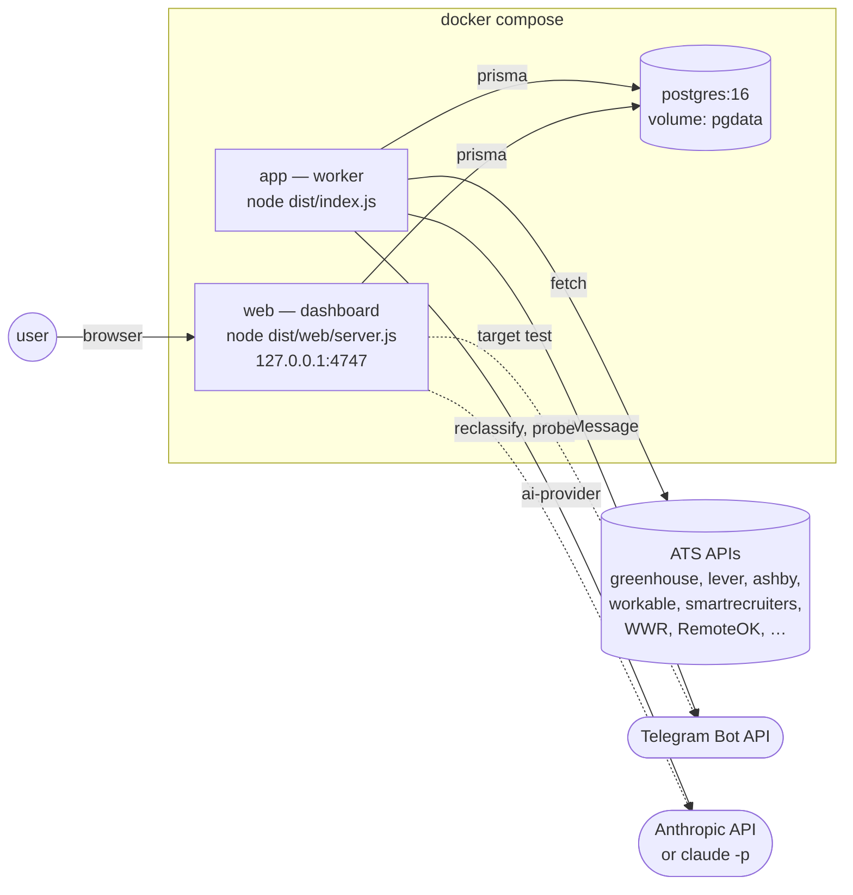
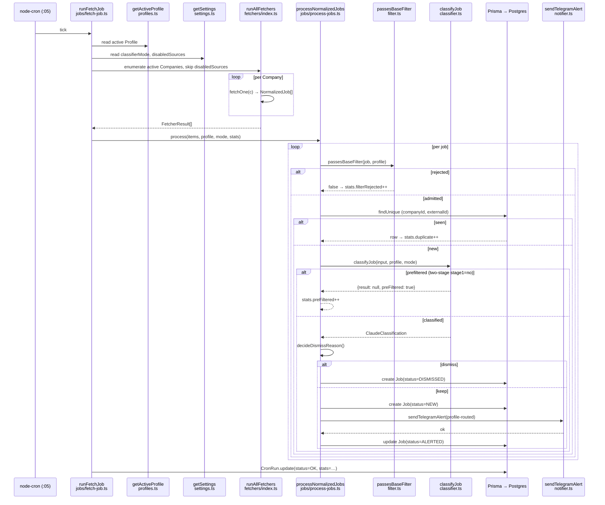
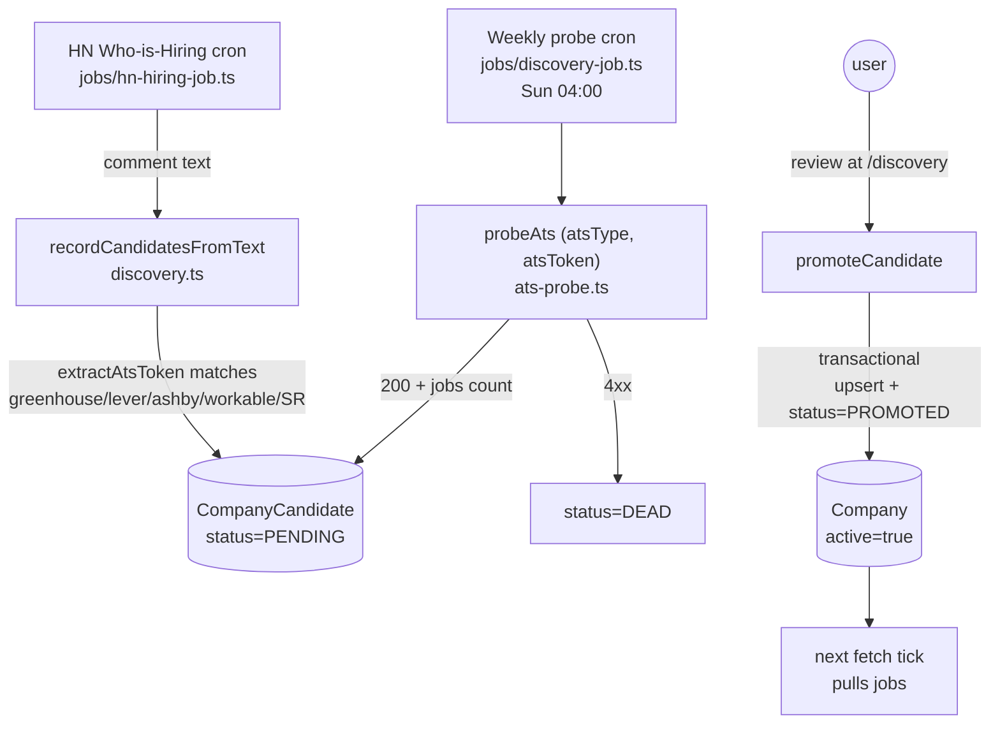
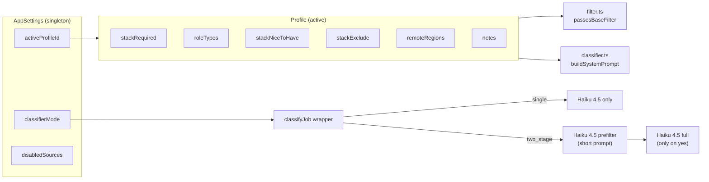
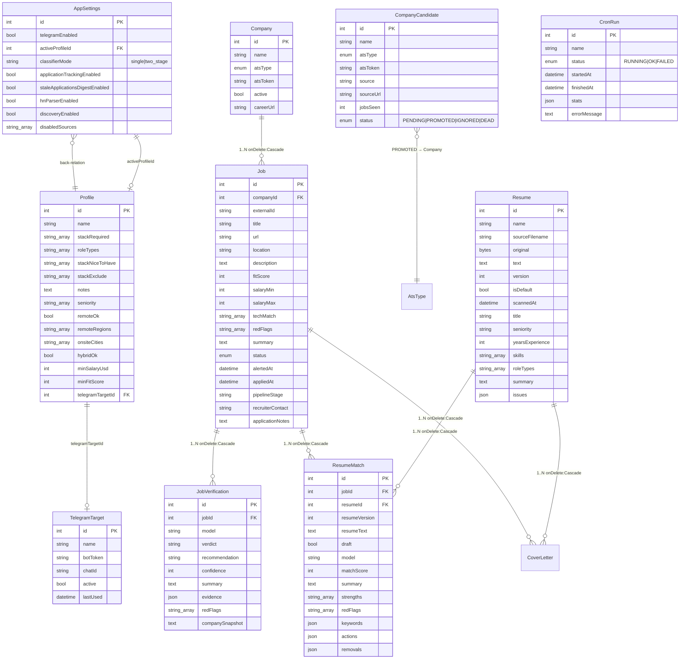

# Architecture

> This is the document I'd point a new contributor (or future-me) at
> to answer "what's actually happening in this codebase?". Pair with
> [SPEC.md](./SPEC.md) (the *what*) and [docs/adr/](./docs/adr/) (the *why*).

## Two-process layout

The whole system is two Node 24 processes plus a Postgres container,
all in the same `docker-compose.yml`:



The worker never opens an HTTP port. The dashboard never registers a
cron job. The two processes share state only through Postgres
([ADR 0002](./docs/adr/0002-worker-and-web-as-separate-processes.md)).

## Per-tick fetch pipeline

This is what runs every hour at `:05` — and, since v1.6.0, whenever
"Fetch now" is pressed on the dashboard (same `runFetchJob`, in the web
process; while the pipeline is paused it stores the new jobs unscored):



Two things to remember while reading this:

1. **`processNormalizedJobs` is the single source of truth for the
   filter → dedupe → classify → persist → alert sequence.** It's
   shared by `runFetchJob` and `runHnHiringJob`. Filter and dedupe run
   first; classification then runs `AI_CONCURRENCY` jobs at a time
   (`src/concurrency.ts`), while persist + alert consume the results in
   the original order — so the DB and Telegram see the same sequence a
   serial loop would produce. `runReclassifyAll` does the same per batch
   of 50.
2. **All toggles read from the DB at the start of the tick.** Flipping
   a toggle in the UI takes effect on the next cron tick — no restart.

## Discovery loop

Discovery is a two-step pipeline that runs in the worker (harvest) and
the web (review):



ADR: [0006-discovery-via-hn-parser.md](./docs/adr/0006-discovery-via-hn-parser.md).

## Profile & classifier mode



The classifier prompt is **dynamic per profile** — every field above
becomes a line in the system prompt. Prompt cache hit is per-profile,
so editing the profile invalidates the cache (next ~5 jobs pay full
input tokens, then it stabilises).

## File map (where each thing lives)

```
src/
  index.ts                     ← cron registration (6 jobs) + graceful shutdown
  init.ts                      ← prisma migrate deploy + seed + bootstrap profile/Telegram
  config.ts                    ← zod-validated env (worker + web)
  logger.ts                    ← pino instance
  db.ts                        ← PrismaClient singleton
  http.ts                      ← fetchWithRetry, stripHtml, AbortController timeout
  types.ts                     ← NormalizedJob, ClaudeClassification, AlertJob
  text-utils.ts                ← pure helpers: parseTagList, extractJson, extractAtsToken,
                                 daysSince, hashShortId, maskToken, decideStageStrategy
  filter.ts                    ← passesBaseFilter (pure, profile-aware)
  ai-provider.ts               ← AiProvider seam: AnthropicApiProvider | ClaudeCodeProvider
  ai-provider-parse.ts         ← pure parser for `claude -p` JSON output (tested)
  prompt-fence.ts              ← untrusted-text markers + directive (pure, tested, ADR 0022)
  concurrency.ts               ← createLimiter(max), pure
  fingerprint.ts               ← SimHash of a JD body + cross-listing search, pure (ADR 0018)
  classifier.ts                ← classifyJob wrapper + classifyWithClaude (full prompt)
  classifier-prefilter.ts      ← preClassify (short prompt)
  notifier.ts                  ← Telegram MarkdownV2 send, multi-target broadcast
  ats-probe.ts                 ← liveness probe for manual /companies add
  profiles.ts                  ← Profile CRUD + getActiveProfile + setActiveProfile
  settings.ts                  ← AppSettings + TelegramTarget CRUD + maskToken re-export
  discovery.ts                 ← CompanyCandidate CRUD + recordCandidatesFromText + promote
  seed.ts                      ← SEED_COMPANIES list + OBSOLETE_TOKENS cleanup

  starter-packs/               ← web-only curated company packs (ADR 0017)
    catalog.json               ← segments + hand-verified (atsType, atsToken) per company
    catalog.ts                 ← zod-validated load + segment lookups (pure)
    resolve.ts                 ← RESOLVE_ORDER, buildResolvePlan, buildPreview, boardUrl (pure)
    probe.ts                   ← runs the plans through probeAts, bounded concurrency + budget

  resume/                      ← web-only resume module (ADR 0008)
    zip.ts                     ← read one entry from a zip (node:zlib), pure
    docx-text.ts               ← word/document.xml → plain text, pure
    pdf-text.ts                ← PDF → plain text via unpdf (ADR 0011), tested
    resume-text.ts             ← upload dispatch by extension, pure
    prompts.ts                 ← scan + match + cover prompts, zod schemas, Json readers, pure
    profile-draft.ts           ← resume scan → profile-editor draft (ADR 0015), pure
    score.ts                   ← deterministic match score + breakdown (ADR 0012), pure
    facts.ts                   ← apply CandidateFacts / cross-resume hints to keywords, pure
    fact-check.ts              ← deterministic fabrication gate for generated prose (ADR 0020), pure
    diff.ts                    ← version delta from two matches (gained/lost, components), pure
    parse-warnings.ts          ← ATS parseability checks over extracted text, pure
    pick.ts                    ← preselect resume by skill-tag overlap, pure
    store.ts                   ← Resume / ResumeMatch / CandidateFact / CoverLetter CRUD (Prisma)
    zip-write.ts               ← minimal STORED zip writer (docx container), pure
    docx-write.ts              ← letter → .docx, round-trip-tested against zip.ts + docx-text.ts, pure
    pdf-write.ts               ← letter → minimal Helvetica PDF, pure
    scan.ts                    ← one AI call → Resume scan fields
    match.ts                   ← one AI call → facts context in, statuses out, score.ts computes → ResumeMatch row
    cover-letter.ts            ← one gated AI call → CoverLetter row; gate block → regen once → refuse (ADR 0021)

  verification/                ← ghost-job check (ADR 0009) + liveness ladder (ADR 0016)
    prompts.ts                 ← checklist prompt, zod schema, evidence reader, pure
    liveness.ts                ← free rungs 1-2: ATS-API probe + page classifier (pure + fetch, no AI)
    verify.ts                  ← checkLiveness → Job.liveness*; AI call with webTools → JobVerification row (Prisma)

  fetchers/
    index.ts                   ← runAllFetchers + fetchOne switch
    {greenhouse,lever,ashby}.ts          per-company JSON fetchers
    {workable,smartrecruiters}.ts        per-company JSON fetchers
    {recruitee,breezy,bamboohr,pinpoint}.ts  per-company JSON fetchers (F2)
    rippling.ts                          per-company list + detail (F2)
    larajobs.ts                          single RSS feed
    {remoteok,remotive,arbeitnow}.ts     aggregator JSON
    fourdayweek.ts                       aggregator JSON, paginated v2 API (F2)
    weworkremotely.ts                    per-category RSS (atsToken = category slug)
    golangprojects.ts                    single RSS feed
    hn-hiring.ts                         Algolia API + comment fetch
    hn-parser.ts                         pure heuristic parser

  jobs/
    fetch-job.ts                ← runFetchJob (cron entry; {manual:true} from "Fetch now")
    digest-job.ts               ← runDigestJob (daily 09:00)
    cleanup-job.ts              ← runCleanupJob (Sunday 03:00)
    stale-applications-job.ts   ← runStaleApplicationsJob (daily 08:00)
    stale-applications-format.ts  pure formatStaleMessage
    hn-hiring-job.ts            ← runHnHiringJob (monthly 1st 06:00)
    discovery-job.ts            ← runDiscoveryJob (Sunday 04:00, validation probe)
    process-jobs.ts             ← shared inner loop used by fetch + HN
    reclassify-job.ts           ← runReclassifyAll (web-triggered, async)
    classify-existing.ts        ← classify one stored job (Re-classify button, manual entry)
    posting-url.ts              ← one user-requested posting-page GET → plain text (ADR 0005 blocklist, honest bot-check failure)
    manual-job.ts               ← pasted posting → MANUAL company + Job + classify (used by /jobs/new and /target)
    cron-run.ts                 ← recordCronRun(name, fn) wrapper

  scripts/
    {fetch,digest,cleanup,stale,hn,discovery}-once.ts  ← npm run X:once
    test-telegram.ts            ← validate token + send 4 sample messages

  web/
    server.ts                   ← Hono app, middleware, basicAuth, listen
    layout.tsx                  ← HTML shell, light design tokens, sidebar nav, Tailwind CDN
    ui.tsx                      ← shared <Card>, <StatusBadge>, <FitBadge>, <Tag>, <Stat>
    format.ts                   ← formatSalary, formatRelative, statusTone, fitTone
    flash.ts                  ← POST → redirect → GET flash cookie
    upload.ts                 ← multipart resume upload helper + 5 MB limit
    target-runs.ts            ← in-memory compare-run registry (async classify/scan/match)
    fetch-runs.ts             ← in-memory "Fetch now" registry (live source progress; the 'fetch-now' CronRun is the record)
    fetch-summary.ts          ← pure one-line verdict of a finished fetch-now run
    welcome-steps.ts          ← pure first-run wizard rules (steps from data, score-run summary)
    welcome-facts.ts          ← loads what the wizard and the Overview chip derive from
    ai-test.ts                ← one live engine call — Settings Test button + wizard step 1
    public/target.mjs         ← browser keyword matcher (pure ES module, node-tested)
    public/score.mjs          ← browser mirror of resume/score.ts (parity-tested, ADR 0012)
    public/cover-letter.mjs   ← copy-to-clipboard for the letter card (import-smoke-tested)
    public/board.mjs          ← /applications drag-and-drop over POST /jobs/:id/stage (planMove tested)
    public/fetch-run.mjs      ← activity lines for the fetch-now progress page (pure; target-run.mjs polls)

    pages/
      overview.tsx              ← /
      jobs-list.tsx             ← /jobs
      job-detail.tsx            ← /jobs/:id
      applications.tsx          ← /applications (board + quick-move + closed panel)
      companies.tsx             ← /companies
      starter-pack.tsx          ← pack picker card + preview + import result
      discovery.tsx             ← /discovery
      runs.tsx                  ← /runs (+ Fetch now button)
      welcome.tsx               ← /welcome first-run wizard (4 steps, one card at a time)
      fetch-run.tsx             ← /runs/fetch-now/:id progress page + FetchNowButton
      run-steps.tsx             ← step list shared by the two progress pages
      settings.tsx              ← /settings (9 cards)
      resumes.tsx               ← /resumes (list + upload form component)
      resume-detail.tsx         ← /resumes/:id
      resume-match-card.tsx     ← "Resume match" card on /jobs/:id
      cover-letter-card.tsx     ← "Cover letter" card on /jobs/:id (F8, ADR 0021)
      verification-card.tsx     ← "Is this job real?" card on /jobs/:id
      job-new.tsx               ← /jobs/new (paste a posting)
      target-start.tsx          ← /target (paste posting + pick/upload/paste resume → one run)
      letter-start.tsx          ← /letter (job by pick/URL/paste + resume + optional match/verify → letter)
      target-run.tsx            ← /target/runs/:id (progress steps, polled by target-run.mjs)
      target.tsx                ← /jobs/:id/target (side-by-side editor, live score)

    routes/
      overview.tsx
      jobs.tsx                  ← list + new (manual) + detail + status + reclassify + verify + resume match + cover letters
      target.tsx                ← /target launcher: resume resolve + manual job + match in one POST
      letter.tsx                ← /letter launcher: job + resume resolve → [extract→classify→match→verify]→letter run
      resumes.tsx               ← upload (5 MB limit) + scan + default + delete + download
      applications.tsx          ← board + stage-only quick-move + per-job application form
      companies.tsx              ← list + new (probe-validated) + delete + toggle + starter packs
      discovery.tsx             ← list + promote + ignore + delete + manual probe
      runs.tsx                  ← /runs + POST /runs/fetch-now (the tick in the web process) + progress/state
      welcome.tsx               ← /welcome + skip / finish / ai test / resume → scan run / profile apply / score run
      settings.tsx              ← profile editor + 8 toggles + telegram targets
      health.ts                 ← JSON liveness for external monitoring

prisma/
  schema.prisma                 ← Company, Job, CronRun, AppSettings, Profile,
                                  TelegramTarget, CompanyCandidate, Resume,
                                  ResumeMatch, JobVerification, CoverLetter, 4 enums
  migrations/                   ← real Prisma migrations from phase-3.0 baseline
```

## What runs when

| Trigger                          | Process | Entry point                              |
| -------------------------------- | ------- | ---------------------------------------- |
| `:05` every hour                 | app     | `runFetchJob`                            |
| `09:00` daily (Chicago)          | app     | `runDigestJob`                           |
| `08:00` daily (Chicago)          | app     | `runStaleApplicationsJob`                |
| `03:00` Sunday                   | app     | `runCleanupJob`                          |
| `04:00` Sunday                   | app     | `runDiscoveryJob`                        |
| `06:00` 1st of each month        | app     | `runHnHiringJob`                         |
| any HTTP request                 | web     | Hono routing                             |
| `POST /settings/reclassify`      | web     | spawns `runReclassifyAll` async (lock)   |
| `POST /settings/hn-run`          | web     | spawns `runHnHiringJob` async (lock)     |
| `POST /jobs/:id/reclassify`      | web     | sync `classifyJob` → auto-demote on fail |
| `POST /companies/new`            | web     | sync `probeAts` → upsert                 |
| `POST /companies/starter-pack`   | web     | resolve a pack live (`probeAts`, ≥1 job wins) → preview; `/import` inserts inactive, `/enable` activates |
| `POST /resumes`                  | web     | extract text → `scanResume` (sync, ~1 min) |
| `POST /jobs/:id/match`           | web     | async run: (scratch cleanup) → `matchResumeToJob`; redirects to `/target/runs/:id` |
| `POST /jobs/:id/verify`          | web     | `checkLiveness` (free rungs, seconds) → stop on a verdict; else / `deep=1` sync `verifyJob` with web tools (2-4 min) → `JobVerification` |
| `POST /jobs/new`                 | web     | MANUAL company upsert + Job + `classifyExistingJob` |
| `POST /target`                   | web     | resolve resume inline (upload/paste → hidden scratch row), then async: `createManualJob` → scratch-match cleanup → `matchResumeToJob`; redirects to `/target/runs/:id` |
| `GET /target/runs/:id`           | web     | progress page (meta-refresh 2s); done → flash + redirect into the targeted view |
| `POST /resumes/:id/replace`      | web     | new file → `version`+1 → `scanResume`    |
| `POST /jobs/:id/target/reupload` | web     | async run: replace (+scan for real resumes; scratch skips it) → match |
| `POST /jobs/:id/cover`           | web     | async run: `generateCoverLetter` (fact-gated; blocked twice → error, no row); redirects to `/target/runs/:id`. The card form also saves the angle prefills; a Regenerate POST reuses them |
| `POST /jobs/:id/cover/:letterId` | web     | save a manual edit; re-runs the gate warn-only, updates `gateVerdict`/`gateNotes` |
| `GET /jobs/:id/cover/:letterId/file/:fmt` | web | letter (edited text wins) → .docx or .pdf attachment, built in-process |
| `POST /letter`                   | web     | job by picker / URL / paste + resume resolve → async run [fetch? → extract? → classify? → match? → verify?] → gated letter. Everything slow is a run step; the POST only shape-checks (§6.2) |
| `POST /resumes/:id/draft`        | web     | edited text → `.md` version → scan (+ match when `jobId`) |
| `GET /static/*`                  | web     | `src/web/public` (keyword matcher)       |
| `POST /discovery/:id/promote`    | web     | transactional Company upsert             |
| `POST /discovery/probe-now`      | web     | spawns `runDiscoveryJob` async (lock)    |

## Database (entity overview)



## Things that surprised me while building this

These are codified as ADRs — go there for the full reasoning:

- [0001 — Hono not Express](./docs/adr/0001-hono-not-express.md)
- [0002 — Worker and web as separate processes](./docs/adr/0002-worker-and-web-as-separate-processes.md)
- [0003 — No queue, just node-cron](./docs/adr/0003-no-queue-just-node-cron.md)
- [0004 — One active profile, not multi-tenant](./docs/adr/0004-single-active-profile.md)
- [0005 — No LinkedIn / Indeed / Workday](./docs/adr/0005-no-linkedin-indeed-workday.md)
- [0006 — Discovery via HN parser](./docs/adr/0006-discovery-via-hn-parser.md)

Also see [CLAUDE.md](./CLAUDE.md) for "where to look" + gotchas.
