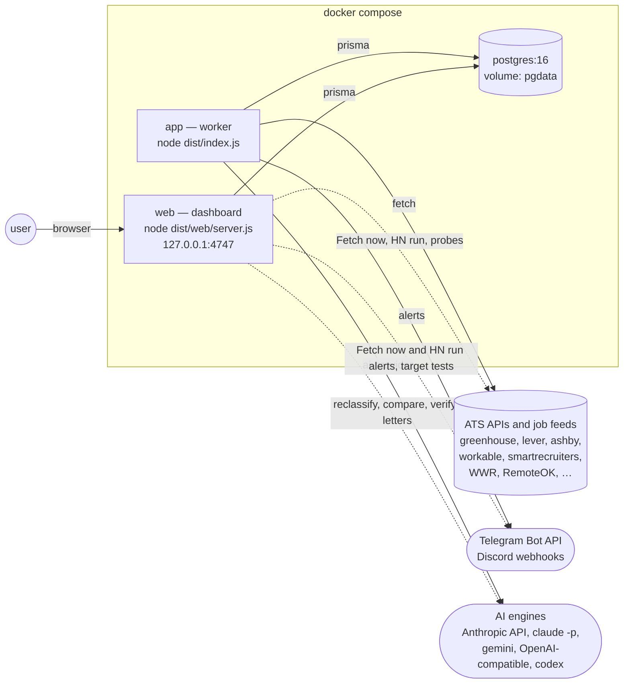
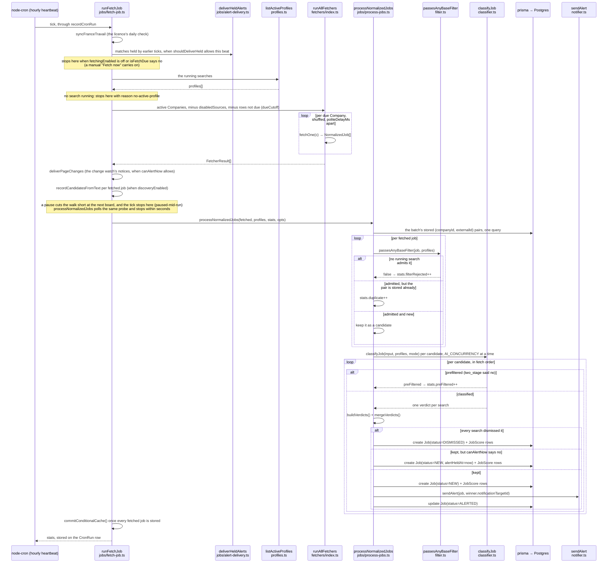
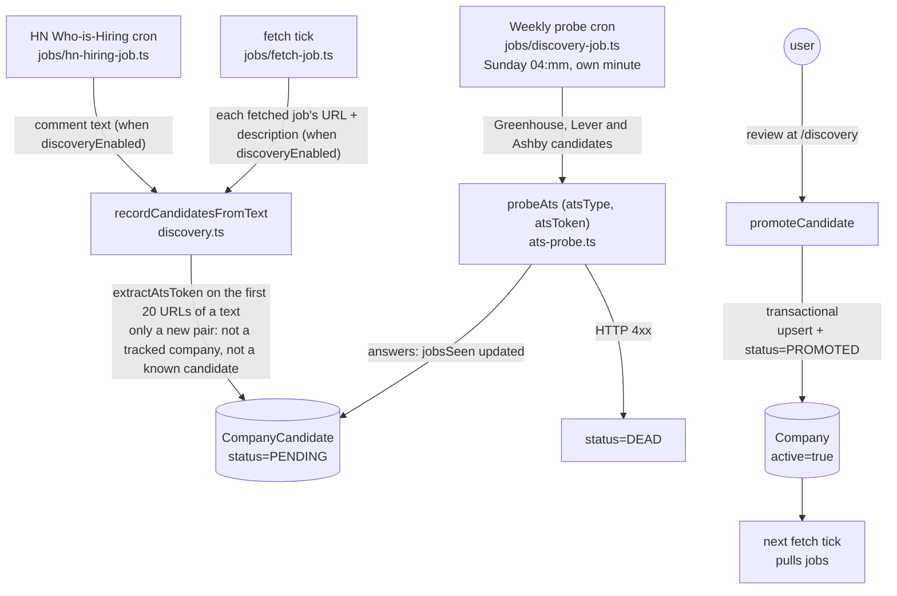
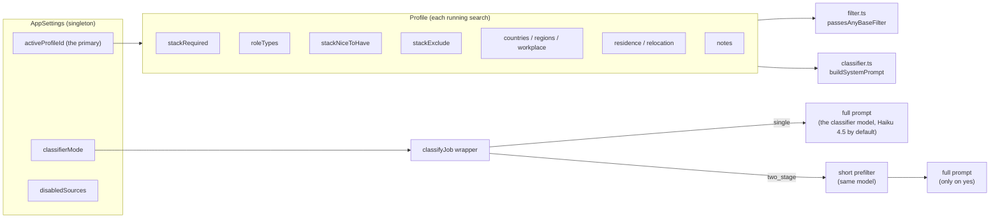

# Architecture

> This is the document I'd point a new contributor (or future-me) at
> to answer "what's actually happening in this codebase?". Pair with
> [SPEC.md](./SPEC.md) (the *what*) and [docs/adr/](./docs/adr/) (the *why*).

## Two-process layout

The whole system is two Node processes plus Postgres. `npm start` runs them
on the user's own computer — `src/local/launcher.ts` starts a built-in
Postgres 16 under `pg_ctl`, then the worker, then the dashboard, and stops
them in reverse ([ADR 0054](./docs/adr/0054-npm-start-runs-a-built-in-database.md)).
On a server the same two processes run as compose services:



The worker never opens an HTTP port. The dashboard never registers a
cron job. The two processes share state only through Postgres
([ADR 0002](./docs/adr/0002-worker-and-web-as-separate-processes.md)).
The dashboard does run two of the worker's jobs on demand: "Fetch now"
runs `runFetchJob` (`src/web/fetch-now.ts`) and `POST /discovery/hn-run`
runs `runHnHiringJob`, in the web process. So new alerts, held alerts and
change notices can leave from either process.

## Per-tick fetch pipeline

This is what runs once an hour, at the minute this install picked for
itself (ADR 0035), when the user's schedule lets the beat search — and,
since v1.6.0, whenever
"Fetch now" is pressed on the dashboard (same `runFetchJob`, in the web
process; while the pipeline is paused it stores the new jobs unscored):



Two things to remember while reading this:

1. **`processNormalizedJobs` is the single source of truth for the
   filter → dedupe → classify → persist → alert sequence.** It's
   shared by `runFetchJob` and `runHnHiringJob`. Filter and dedupe run
   first; classification then runs `AI_CONCURRENCY` jobs at a time
   (`src/concurrency.ts`), while persist + alert consume the results in
   the original order — so the database and the alert targets see the same
   sequence a serial loop would produce. `runReclassifyAll` does the same
   per batch of 50.
2. **All toggles read from the DB at the start of the tick.** Flipping
   a toggle in the UI takes effect on the next cron tick — no restart.
   The pause is the exception: a running tick polls it
   (`src/jobs/fetch-pause.ts`, every five seconds) and stops within
   seconds.

A match held outside the alert window stays NEW with its `alertHeldAt`
stamp. `deliverHeldAlerts` sends the held rows on the first heartbeat the
schedule allows (`user-schedule.ts:shouldDeliverHeld`): inside the alert
window in window mode, at a digest hour in digest mode, and on any beat in
instant mode, where a held row is a leftover from an earlier setting. It
runs above the pause and the schedule gate. The rows are grouped by the
target their winning search routes to (`held-alerts.ts:groupHeldByTarget`),
one delivery per group; the group with no target goes to every active
target, and so does a group whose target is switched off.

## Discovery loop

Discovery is a two-step pipeline: a harvest, then a review on
`/discovery`. The harvest runs wherever a fetch tick or the HN job runs:
in the worker on the cron, and in the web process for "Fetch now" and
`POST /discovery/hn-run`. The weekly probe also has a manual trigger,
`POST /discovery/probe-now`.



ADR: [0006-discovery-via-hn-parser.md](./docs/adr/0006-discovery-via-hn-parser.md).

## Profile & classifier mode



The classifier prompt is built from **every running search**: each one's
fields above become its own block in the system prompt, and one reply
scores the posting for each of them (ADR 0028). The model is the engine's
classifier slot, or `CLAUDE_MODEL` (Haiku 4.5) on the two Claude engines
when the slot is empty.

Prompt caching does nothing here, measured 2026-09-02 (gotcha 3 in
[CLAUDE.md](./CLAUDE.md)): `cache_creation_input_tokens` was 0 on every
call. Haiku 4.5 caches only a prefix of at least 4096 tokens, and the
classifier system prompt is about 1216 (about 2100 with eight searches).
Only the Anthropic API path sets `cache_control` on the system prompt
(`src/ai-provider.ts`); the `claude_code` CLI sets none. Editing a profile
therefore costs nothing extra, and no design here should count on a cache.

## File map (where each thing lives)

The tree lists every non-test source file under `src/`. Most `*.test.ts`
files sit next to the code they test. The tests of the browser modules in
`src/web/public/` sit in `src/web/`, and a few tests check the repository
as a whole: `src/docs-paths.test.ts`, `src/prompt-fence-registry.test.ts`,
`src/source-count.test.ts`, `src/web/self-contained.test.ts`,
`src/web/site-vendor.test.ts` and `src/web/tone-parity.test.ts`.

```
src/
  index.ts                     ← the worker: cron registration (6 jobs) + graceful shutdown
  init.ts                      ← boot: prisma migrate deploy (db push without migrations) + seed
                                 + first boot: a blank profile, alert targets from .env
  config.ts                    ← zod-validated env (worker + web); an empty DATABASE_URL reads the built-in database's db.json
  logger.ts                    ← pino instance
  db.ts                        ← PrismaClient singleton
  types.ts                     ← NormalizedJob, ClaudeClassification, ClassifyInput, AlertJob
  http.ts                      ← fetchWithRetry, stripHtml, AbortController timeout
  text-utils.ts                ← pure helpers: parseTagList, extractJson, extractAtsToken, feedItemKey,
                                 daysSince, hashShortId, maskToken, decideStageStrategy
  cancellation.ts              ← makeLatchingProbe: a flag long loops can poll cheaply (pure)
  concurrency.ts               ← createLimiter(max), pure
  schedule.ts                  ← pure: this install's cron minute, from instanceId (ADR 0035)
  user-schedule.ts             ← pure: the user's own schedule — when the search runs,
                                 when alerts may leave, which hours are digest hours
  seed.ts                      ← SEED_COMPANIES list + OBSOLETE_TOKENS cleanup
  settings.ts                  ← AppSettings + NotificationTarget CRUD, the key accessors, maskToken re-export
  profiles.ts                  ← Profile CRUD, listActiveProfiles, getActiveProfile / setActiveProfile, setProfileActive
  profile-guards.ts            ← pure: the blank-profile guards (issue #50) and MAX_ACTIVE_PROFILES
  priority-rules.ts            ← pure: parsePriorityRules, the score floors a search sets
  eligibility.ts               ← pure: where the candidate lives, the relocation choices, residenceCovered (ADR 0033)
  currency.ts                  ← pure: salary in the posting's own money, toUsdPerYear over a dated rate table
  filter.ts                    ← pure: passesAnyBaseFilter over passesBaseFilter, titleHasKeyword, placesOverlap
  fingerprint.ts               ← SimHash of a JD body + cross-listing search, pure (ADR 0018)
  apply-link.ts                ← pure: flags an apply link nobody can apply through (ADR 0023)
  countries.{json,ts}          ← the gazetteer: 86 countries, cities, region groups; lookups (pure, ADR 0031)
  location.ts                  ← parseLocation: string + fetcher hints → workplace/countries/regions (pure, ADR 0031)
  location-corpus.json         ← every stored location string on 2026-09-03 with its pinned reading (a test)
  robots.ts                    ← pure: RFC 9309 reader; an AI-agent ban binds us (ADR 0036)
  source-keys.ts               ← pure: the keys of the keyed sources, redactSecrets (ADR 0034)
  ats-probe.ts                 ← probeAts: does a board answer, with how many jobs (manual add, packs, watchlist, discovery)
  discovery.ts                 ← CompanyCandidate CRUD + recordCandidatesFromText + promoteCandidate
  classifier.ts                ← classifyJob: one call scores a posting for every running search
                                 (buildSystemPrompt, parseClassifications)
  classifier-prefilter.ts      ← preClassify (the short two_stage prompt)
  prompt-fence.ts              ← untrusted-text markers + directive (pure, tested, ADR 0022)
  ai-engine.ts                 ← pure: the engine chain, the models per role, defaultModelFor (ADR 0013/0014)
  ai-keys.ts                   ← pure: per-engine API keys, DB first, .env as fallback (ADR 0027)
  ai-runtime.ts                ← getAiRuntime().complete(): the chain with failover, usage counters, engine probes
  ai-cooldown.ts               ← pure: an engine that keeps failing is skipped for a while
  ai-provider.ts               ← the AiProvider seam: AnthropicApiProvider, OpenAiApiProvider,
                                 CliProvider (claude_code, gemini_cli, codex_cli)
  ai-provider-parse.ts         ← pure: CLI arguments, the child env allowlist, reply parsers, anthropicMaxTokens
  ai-json.ts                   ← askForJson: a call parsed by a schema, one retry unless the reply was cut off
  notifier.ts                  ← sendAlert / sendDigest: to the routed target when it is active, else to every active
                                 target; the Telegram channel (MarkdownV2) and the switch to notify/discord.ts
  notify/                      ← the alert channels' shared pieces (ADR 0041)
    discord.ts                 ← the Discord channel: webhook POST + its markdown
    lines.ts                   ← pure: the words both channels share (place line, salary, quiet sources)
    pack.ts                    ← pure: packMessages, blocks under a header within a length limit
    targets.ts                 ← pure: KIND_LABEL, describeDestination with the secret masked
  local/                       ← npm start without Docker (ADR 0054)
    launcher.ts                ← the data folder's lock, then the database, the worker, the dashboard; stops in reverse
    postgres.ts                ← the built-in Postgres 16 through pg_ctl (I/O)
    {data-dir,db-state,postgres-setup,supervise}.ts ← pure: the data folder, db.json, initdb and pg_ctl
                                 arguments, the restart rules
    child.ts                   ← announceReady / onLauncherStop for the worker and the dashboard (no-ops alone)
  watchlist/                   ← the company watchlist (ADR 0036)
    interval.ts                ← pure: check intervals, due-ness (dueCutoff), the ★ and the alert policy
    parse-input.ts             ← pure: the "one URL per line" textarea
    scan.ts                    ← pure: board links, job-shaped feeds, bot-check wording
    page-hash.ts               ← pure: the change watch's text hash and its once-a-day rule
    verdict.ts                 ← pure: how a resolution reads on screen (progress lines, preview badges)
    resolve.ts                 ← the ladder (I/O injected; liveResolveIo touches the network)
    page-changes.ts            ← the careers pages that changed this tick, staged for jobs/page-change-alerts.ts

  starter-packs/               ← web-only curated company packs (ADR 0017)
    catalog.json               ← segments + hand-verified (atsType, atsToken) per company
    catalog.ts                 ← zod-validated load + segment lookups (pure)
    resolve.ts                 ← RESOLVE_ORDER, buildResolvePlan, buildPreview, boardUrl (pure)
    probe.ts                   ← runs the plans through probeAts, bounded concurrency + budget
    suggest.ts                 ← pure: suggestSources / packsForSearches, what a search's places and stack call for

  resume/                      ← web-only resume module (ADR 0008); store.ts is its only Prisma access
    zip.ts                     ← read one entry, or all of them, from a zip (node:zlib), pure
    docx-text.ts               ← word/document.xml → plain text: DOM walk (blocks + line owners) with the regex reader as fallback, parity-tested (ADR 0038)
    docx-structure.ts          ← the template check: flow / structural / unsupported, editable lines, notes (ADR 0038), pure
    docx-patch.ts              ← line diff written back into the user's .docx paragraphs, four gates (ADR 0038), pure
    docx-props.ts              ← core.xml properties: read, fix on click, stamp modified (ADR 0038), pure
    line-diff.ts               ← server bridge to public/line-diff.mjs, so the sheet and the patcher share one diff
    fixtures/*.docx            ← flow-fragmented (resume 1's structural twin), flow-simple, structural-table-layout
    fonts/                     ← Liberation Sans regular + bold (OFL 1.1) and their licence, embedded by render/clean-pdf.ts
    pdf-text.ts                ← PDF → plain text via unpdf (ADR 0011), tested
    resume-text.ts             ← upload dispatch by extension (.pdf, .docx, .md, .txt), pure
    prompts.ts                 ← every resume prompt (brief, scan, structure, match in two variants, suggestions,
                                 rewrite, review, cover), their zod schemas, Json readers; pure
    match-mode.ts              ← quick check vs full report: the marker inside breakdown JSON (ADR 0029), pure
    match-reuse.ts             ← is a stored row the answer? reuse / suggestions-only / new run, pure
    match-name.ts              ← pure: the name a comparison shows for the resume it judged
    bench-report.ts            ← saved bench runs → latency + status-agreement table, pure
    variance.ts                ← pure: what one pair's repeated comparisons vary by (npm run variance:compare)
    profile-draft.ts           ← resume scan → profile-editor draft (ADR 0015), pure
    score.ts                   ← deterministic match score + breakdown (ADR 0012), pure
    red-flags.ts               ← pure: countableFlags, the red flags the score may charge for
    keyword-shape.ts           ← pure: dropMalformedKeywords, what a keyword may be (ADR 0044)
    keyword-anchor.ts          ← pure: anchorStatuses, presence read off the text (ADR 0045)
    keyword-group.ts           ← pure: reconcileGroups, only the group labels the brief wrote (ADR 0044)
    keyword-frame.ts           ← pure: planKeywordFrame, whether a run inherits the posting's keyword frame
    keyword-overrides.ts       ← pure: the user's re-level / ignore / add, carried into the next reply
    keyword-aliases.ts         ← pure: spelling variants unioned into every keyword
    keyword-matcher.ts         ← loads public/target.mjs, the one keyword matcher, for the server
    evidence.ts                ← pure: annotateEvidence, how strongly the text shows a keyword
    facts.ts                   ← apply CandidateFacts / cross-resume hints to keywords, pure
    fact-check.ts              ← deterministic fabrication gate for generated prose (ADR 0020), pure
    diff.ts                    ← version delta from two matches (gained/lost, components), pure
    applied.ts                 ← pure: the last report's wording the text now carries (the churn guard)
    change-sheet.ts            ← the wording a suggestion proposes + the whole list as Markdown, pure
    replacement-gate.ts        ← may this replacement be applied, may this span be deleted? fact check + keyword rules at persist time (ADR 0037/0044), pure
    suggestion-floor.ts        ← pure: floorGaps, REQUIRED COVERAGE checked in code
    parse-warnings.ts          ← ATS parseability checks over extracted text, pure
    pick.ts                    ← preselect: profile link first, then skill-tag overlap, pure
    brief-depth.ts             ← pure: postingDepth, how much the posting said
    posting-orientation.ts     ← pure: the posting's sector, product and first reader, off the stored brief
    domain.ts                  ← pure: domainMismatch, the posting's sector against the resume's (ADR 0046)
    verification-hint.ts       ← pure: the "Is this job real?" line on a comparison
    addressee.ts               ← pure: who the letter greets, read out of the verifier's finding
    answers.ts                 ← pure: the strength review's questions and the candidate's answers (ADR 0030)
    review-score.ts            ← pure: the strength score from the model's grades (ADR 0030)
    review-delta.ts            ← pure: what moved between two reviews of the same resume
    json-resume.ts             ← pure: the JSON Resume subset ApplyPack renders (ADR 0039)
    structure-anchor.ts        ← pure: anchorStructure, every string a verbatim span of the text
    structure-from-text.ts     ← pure: a resume's shape from the extracted text alone
    style-infer.ts             ← the typeface a resume is set in, read from its own runs (ADR 0039)
    render/                    ← the clean single-column re-render (ADR 0039)
      sections.ts              ← pure: planRender, one plan drawn twice
      clean-docx.ts            ← renderDocx: the plan as a .docx in the user's font family
      clean-pdf.ts             ← renderPdf: the plan as a PDF with Liberation Sans embedded
      knobs.ts                 ← pure: RenderKnobs, prefilled from the file and read from the form
      drawable.ts              ← pure: folds what the bundled face cannot draw
    store.ts                   ← Resume / ResumeMatch / ResumeReview / CandidateFact / CoverLetter / PostingBrief (Prisma)
    zip-write.ts               ← minimal STORED zip writer (docx container), pure
    docx-write.ts              ← letter → .docx, round-trip-tested against zip.ts + docx-text.ts, pure
    pdf-write.ts               ← letter → minimal Helvetica PDF, pure
    scan.ts                    ← one AI call → Resume scan fields (+ scanInBackground)
    structure.ts               ← one AI call → Resume.structure, started from the render page (ADR 0039)
    brief.ts                   ← one AI call over the POSTING alone → PostingBrief row, cached by posting text (ADR 0044)
    match.ts                   ← one AI call (fast | full) → brief + facts context in, statuses out, score.ts computes → ResumeMatch row
                                 (a second, cheaper call when suggestion-floor.ts finds a gap)
    suggestions.ts             ← the lazy second call: stored verdicts in, actions/removals out → same row (ADR 0029)
    rewrite.ts                 ← one suggestion written again: target kept, wording re-gated → actions column only
    review.ts                  ← one AI call → a ResumeReview row (the strength review, ADR 0030)
    cover-letter.ts            ← one gated AI call → CoverLetter row; gate block → regen once → refuse (ADR 0021)

  screening/                   ← employer mode (TASKS §19, ADR 0047–0052); web-only, off by default
    rubric.ts                  ← pure: what a screening checks, drafted from the posting brief, edited by the person
    redact.ts                  ← pure: the applicant taken out of the text before any model reads it (ADR 0048)
    dates.ts                   ← pure: resume dates in five languages → years covered, months since
    prompts.ts                 ← buildScreenPrompt + ScreenReplySchema (one answer per criterion, roles, stand-out facts,
                                 questions) and buildComparePrompt
    anchor.ts                  ← pure: every quote checked against the redacted text; unproven rungs lowered
    score.ts                   ← pure: the employer score, its caps, the bucket, the confidence (ADR 0050)
    trajectory.ts              ← pure: the career read off the dated roles (years, employers, average stay, sectors) — a fact, never points
    comparison.ts              ← pure: a shortlist's two readings — stored shape, the anchor, where they differ, the Markdown (ADR 0051)
    compare.ts                 ← Compare with AI: two calls at once (the second reversed), both stored as one ScreeningComparison
    calibration.ts             ← pure: the person's decisions against the table's order — pairs, top k, surprises, per-criterion gaps (ADR 0052)
    bench.ts                   ← pure: Kendall τ, precision@k, stability, gate confusion for the gold-set bench (scripts/screen-bench-once.ts)
    intake.ts                  ← pure: zip expansion, duplicate detection, the caps
    export.ts                  ← pure: CSV / Markdown of the table
    notice.ts                  ← the applicant notice and the legal note, as text
    store.ts                   ← the only Prisma access in the module
    batch.ts                   ← one call per applicant under the limiter; verdicts persisted as they arrive
    fixtures/gold/             ← the bench's gold sets: a posting, its rubric, resumes and a human's ranking (README there)

  verification/                ← ghost-job check (ADR 0009) + liveness ladder (ADR 0016)
    prompts.ts                 ← checklist prompt, zod schema, evidence reader, pure
    liveness.ts                ← free rungs 1-2: ATS-API probe + page classifier (pure + fetch, no AI)
    verify.ts                  ← checkLiveness → Job.liveness*; AI call with webTools → JobVerification row (Prisma)

  fetchers/
    index.ts                   ← runAllFetchers (roster, due filter, health rows, the walk) + fetchOne switch
    fetch-context.ts           ← pure: searchPlaces, the union of the running searches' places (FetchContext)
    source-order.ts            ← pure: seeded shuffle of the walk + politeDelayMs (ADR 0035)
    conditional.ts             ← ETag / Last-Modified per source; a 304 returns no jobs (ADR 0035)
    source-health.ts           ← pure: error → status, failure streak, quiet / silent (ADR 0019)
    {dates,xml-text}.ts        ← pure: safeDate for feed dates; rss-parser custom fields
    {greenhouse,lever,ashby}.ts ← per-company JSON fetchers
    {workable,smartrecruiters}.ts ← per-company JSON fetchers (SmartRecruiters: list + detail)
    {recruitee,breezy,bamboohr,pinpoint}.ts ← per-company JSON fetchers (F2)
    rippling.ts                ← per-company list + detail (F2)
    personio.ts                ← per-company XML feed
    teamtailor.ts              ← per-company RSS, or a custom career domain as the token
    feed.ts                    ← a generic RSS / Atom job feed; the atsToken is the feed URL (ADR 0036)
    career-page.ts             ← the change watch: hashes a careers page and never returns a job (ADR 0036)
    {larajobs,golangprojects}.ts ← single RSS feed
    weworkremotely.ts          ← per-category RSS (atsToken = category slug)
    {remoteok,remotive,arbeitnow}.ts ← aggregator JSON
    {workingnomads,himalayas}.ts ← aggregator JSON, all categories (Himalayas asks per place)
    jobicy.ts                  ← aggregator RSS, asked per place
    fourdayweek.ts             ← aggregator JSON, paginated v2 API (F2)
    {solidjobs,jobtech}.ts     ← Poland's and Sweden's boards: JSON APIs, paginated
    {devitjobs,landingjobs}.ts ← RSS / Atom boards for Germany, the UK and the Netherlands; Portugal
    {dou,djinni}.ts            ← Ukraine's boards via RSS, one row per query or filter
    dou-title.ts               ← pure: DOU's title grammar → role, company, salary, places
    {adzuna,francetravail}.ts  ← the keyed sources, on the user's own account (ADR 0034)
    francetravail-auth.ts      ← France Travail's OAuth client-credentials token, cached per process
    hn-hiring.ts               ← Algolia API + comment fetch
    hn-jobs.ts                 ← Algolia tags=job: individual YC posts, 14-day window
    hn-parser.ts               ← pure heuristic parser

  jobs/
    fetch-job.ts                ← runFetchJob (cron entry; {manual:true} from "Fetch now")
    fetch-pause.ts              ← makeFetchPauseProbe: a pause on /settings stops a running tick within seconds
    process-jobs.ts             ← processNormalizedJobs: the shared inner loop used by fetch + HN
    verdict-merge.ts            ← pure: one verdict per search, the winner, the score line (ADR 0028)
    score-store.ts              ← the one write path for a re-score of a stored job
    location-merge.ts           ← pure: the classifier's place fills or narrows the parser's, never blanks it (ADR 0032)
    location-reason.ts          ← pure: "open to Poland; this search hunts in …" for the job page (ADR 0032)
    alert-delivery.ts           ← deliverHeldAlerts: sends the held matches on the first beat the schedule allows
    held-alerts.ts              ← pure: groupHeldByTarget, one delivery per routing target, the broadcast group apart
    page-change-alerts.ts       ← deliverPageChanges: one message for the changed careers pages, then the hash advances
    france-travail-sync.ts      ← the licence's daily re-check of the stored France Travail offers (ADR 0034)
    digest-job.ts               ← runDigestJob (hourly beat; works on the user's digest hours)
    stale-applications-job.ts   ← runStaleApplicationsJob (hourly beat; the day's first digest hour)
    stale-applications-format.ts ← pure formatStaleMessage
    applied-with.ts             ← pure "Senior Backend v3" label for the applied resume
    cleanup-job.ts              ← runCleanupJob (Sunday 03:00)
    hn-hiring-job.ts            ← runHnHiringJob (the 1st of the month, 06:mm)
    discovery-job.ts            ← runDiscoveryJob (Sunday 04:mm, validation probe)
    reclassify-job.ts           ← runReclassifyAll + runScoreUnscored (web-triggered, async)
    score-pick.ts               ← pure ranking of unscored jobs by profile mentions (wizard step 5)
    classify-existing.ts        ← classify one stored job (Re-classify button, manual entry)
    posting-url.ts              ← one user-requested posting-page GET → plain text (ADR 0005 blocklist, honest bot-check failure; an Ashby URL is read from its board API)
    posting-extract.ts          ← one cheap classifier-model call: company, title, location, salary of a pasted posting
    description-diff.ts         ← pure: what "Refresh the description" is about to do (sizes, folded diff rows, the flashes — ADR 0043)
    description-refresh.ts      ← the swap: replace / restore Job.description, keep the original, re-fingerprint, re-classify
    manual-job.ts               ← pasted posting → MANUAL company + Job, classified unless the caller passes classify: false
                                  (used by /jobs/new, /target, /letter and /screen/new; the last three pass it,
                                  and /target classifies a new job in the background instead)
    cron-run.ts                 ← recordCronRun(name, fn) wrapper

  scripts/                      ← hand-run; CI runs route-smoke.ts only
    {fetch,digest,cleanup,stale,hn,discovery}-once.ts ← one cron job now (npm run fetch:once …)
    test-telegram.ts            ← validate token + send 4 sample messages
    route-smoke.ts              ← every GET route, the first run's POSTs, one PDF render (npm run smoke:routes)
    backfill-{descriptions,fingerprints,apply-link-flags,locations}.ts ← one-shot backfills (--dry-run first)
    refetch-descriptions.ts     ← re-pulls the boards and updates stored descriptions in place
    rescan-resumes.ts           ← scans every stored resume again (a field the scan learned later)
    reanchor-matches.ts         ← re-applies ADR 0045's presence rule to stored comparisons
    rescore-screenings.ts       ← re-anchors and re-scores stored screening verdicts, no AI call
    resume-bench-once.ts        ← npm run bench:resume: the match prompt over the gold fixtures
    screen-bench-once.ts        ← npm run bench:screen: a gold folder through the screening path
    verify-brief-once.ts        ← npm run verify:compare: the compare pipeline against one stored row
    match-matrix-once.ts        ← npm run matrix:compare: resumes × postings, every invariant checked
    match-variance-once.ts      ← npm run variance:compare: one pair N times, the spread attributed
    churn-once.ts               ← npm run churn:compare: analyse → apply everything → analyse
    keyword-audit.ts            ← npm run keywords:audit: the keyword matcher over stored comparisons
    priority-rules-dryrun.ts    ← npm run priority:dryrun: which stored jobs a profile's priorityRules match
    dead-exports.ts             ← npm run exports:audit: exported symbols nobody imports

  web/                          ← the dashboard: its own process (Hono), read-mostly
    server.ts                   ← listens on WEB_HOST:WEB_PORT and stops on a signal; the app is app.ts
    app.ts                      ← the Hono app: secure headers, basicAuth, originGuard, body limits,
                                  /static files, every route, the error handler
    layout.tsx                  ← HTML shell, the :root token block, grouped sidebar nav, the committed Tailwind build
    tailwind.css                ← the Tailwind source; npm run css builds public/tailwind.css from it
    tokens.ts                   ← the design tokens' values + contrast arithmetic (pure); tokens.test.ts holds every text colour to AA
    ui.tsx                      ← the shared primitives: <PageHeader>, <Card>, <Empty> (title · why · one action), <Disclosure>, <More>, <Tabs>, <FilterChip>, <MetricStrip>, <StatusBadge>, <FitBadge>, <Tag>, the form controls
    table-hide.ts               ← pure: the classes that hide a table column below a breakpoint
    format.ts                   ← formatSalary, formatDate / formatStamp (in the request's zone), formatRelative, statusTone, fitTone, fitWord
    display-zone.ts             ← the zone a request's dates are written in: the schedule's, set by app.ts (AsyncLocalStorage)
    flash.ts                    ← POST → redirect → GET flash cookie; firstIssue names the field a schema refused (pure)
    params.ts                   ← idParam / intQuery: ids and numbers off the request, a 400 where a 500 would be
    same-origin.ts              ← pure: sameOriginPost, the cross-origin write decision (issue #69)
    origin-guard.ts             ← originGuard: the middleware that answers a cross-origin POST with a 403
    body-limits.ts              ← the body limit for every POST that is not an upload
    once-guard.ts               ← onceGuard: a second press of work still running is refused
    inflight.ts                 ← beginOnce / endOnce: the in-process keys behind it
    delete-confirm.ts           ← pure: the confirm text for the two deletes that cascade
    upload.ts                   ← multipart resume upload helper + 5 MB limit
    employer-mode.ts            ← the switch, cached in the web process; requireEmployerMode on every /screen route
    job-facets.ts               ← /jobs place / workplace / posted facets: params, where, chip counts; the list's URLs (jobsHref), the filters in force (pure)
    job-tabs.ts                 ← the job page's tabs: resolveJobTab (explicit, else inferred from match= / letter=), jobHref, the labels with what exists (pure)
    job-pick.ts                 ← the jobs a candidate launcher offers (fit threshold, newest, ?job= kept)
    runs-summary.ts             ← a run's stats as facts in a fixed order, a reason as a sentence (pure) — what /runs shows instead of JSON
    schedule-view.ts            ← loadNextCheck: the "next check" line the Overview and /settings share
    stage-config.ts             ← pure: the board's columns (ADR 0025): parse, add / remove / move / rename
    stage-events.ts             ← pure: the JobStageEvent row of a stage move (ADR 0024)
    stage-time.ts               ← pure: time in stage for the /applications cards
    applied-resume.ts           ← pure: which resume an application went out with, as the three Job columns
    profile-links.ts            ← pure: a search's resume or alert target deleted meanwhile, said in words
    profile-from-resume.ts      ← "create a search from this resume": blank-base draft + inactive create
    source-groups.ts            ← pure: the Job sources grid on /settings, grouped and counted
    source-names.ts             ← sourceLabel: human names for AtsType values
    source-suggestions.ts       ← the token-driven feeds the running searches call for, with their state here
    welcome-steps.ts            ← pure first-run wizard rules (steps from data, score-run summary)
    welcome-facts.ts            ← loads what the wizard and the Overview chip derive from
    ai-test.ts                  ← one live engine call — Settings Test button + wizard step 1
    fetch-now.ts                ← beginFetchNow: "Fetch now" from /runs, the Overview and the wizard
    fetch-runs.ts               ← in-memory "Fetch now" registry (live source progress; the 'fetch-now' CronRun is the record)
    fetch-summary.ts            ← pure one-line verdict of a finished fetch-now run
    watchlist-runs.ts           ← in-memory registry of a watchlist resolve run
    target-runs.ts              ← in-memory registry of the progress-page runs (scan, match, verify, letter, …)
    comparison-run.ts           ← startComparison / runComparison: one text × one stored job as a progress-page run
    suggestions-run.ts          ← startSuggestionsRun: the lazy suggestions call as a run
    resume-source.ts            ← the launchers' "which resume": one of yours / file / paste → scratch row
    resume-label.ts             ← a resume as a <select> option: name · kind version · why preselected (pure)
    lane.ts                     ← pure: which engine and model family a resume call runs on, and its time band
    match-history.ts            ← pure: a resume page's comparisons grouped by posting
    score-lines.ts              ← pure: the five sentences under the score, mainAdvice, readyToApply
    no-edits.ts                 ← pure: what an empty suggestion list says about itself
    screen-view.ts              ← pure: stored applicant + verdict → table row / export row
    screen-compare.ts           ← pure: ticked applicants as columns, one row per criterion (side by side)

    public/                     ← browser modules served as-is at /static/ (no build step)
      tailwind.css              ← the generated Tailwind build (npm run css), committed
      fonts/                    ← Inter (woff2) and its licence
      target.mjs                ← browser keyword matcher (pure ES module, node-tested)
      score.mjs                 ← browser mirror of resume/score.ts (parity-tested, ADR 0012)
      target-page.mjs           ← the targeted view's DOM wiring over target.mjs and score.mjs
      text-edits.mjs            ← apply / remove / add-a-term / undo over the resume text (pure, node-tested)
      line-diff.mjs             ← LCS line diff of the analysed text vs the editor (pure, node-tested)
      change-sheet.mjs          ← "Copy my changes" as Markdown over line-diff.mjs (pure, node-tested)
      copy.mjs                  ← copy-to-clipboard for every page (delegated, execCommand fallback, aria-live)
      cover-letter.mjs          ← autosave + fact-check status for the letter card (import-smoke-tested)
      target-run.mjs            ← progress pages: polls the run's state route every 2 s, then reloads
      fetch-run.mjs             ← activity lines for the fetch-now progress page (pure; target-run.mjs polls)
      launcher.mjs              ← the launchers' mode boxes and job filter (/target, /letter, /screen/new)
      target-start.mjs          ← /target: a pasted posting trimmed in place by posting-clean.mjs
      posting-clean.mjs         ← pure: strips page chrome from a pasted posting
      board.mjs                 ← /applications drag-and-drop over POST /jobs/:id/stage (planMove tested)
      chips.mjs                 ← the chip editor over a newline-joined textarea
      countries.mjs             ← country picker: search over /countries.json + the suggestion list (tested via import())
      select-commit.mjs         ← a self-saving select that saves once, not once per arrowed option
      settings-models.mjs       ← the per-engine model pickers save themselves
      progress.mjs              ← the navigation progress bar
      screen.mjs                ← the screening page: polls the run, ticks rows, saves a decision, uploads a folder
      watchlist.mjs             ← the watchlist's resolve progress and its self-saving selects

    pages/
      overview.tsx              ← /
      jobs-list.tsx             ← /jobs
      job-detail.tsx            ← /jobs/:id (tabs: posting, match, letter, verify)
      job-new.tsx               ← /jobs/new (paste a posting)
      resume-match-card.tsx     ← the "Resume match" tab's comparison card
      cover-letter-card.tsx     ← the "Cover letter" tab (F8, ADR 0021)
      verification-card.tsx     ← the "Is it real?" tab
      description-refresh.tsx   ← the line-by-line preview before a description is replaced with the company's listing (ADR 0043)
      attribution.tsx           ← what a vendor's terms make a listing say (AdzunaLabel, FranceTravailLine) (ADR 0034)
      applications.tsx          ← /applications (board + quick-move + closed panel)
      companies.tsx             ← /companies
      starter-pack.tsx          ← pack picker card + preview + import result
      watchlist.tsx             ← the watchlist section of /companies, the resolve progress page, its preview
      discovery.tsx             ← /discovery
      runs.tsx                  ← /runs (+ Fetch now button)
      fetch-run.tsx             ← /runs/fetch-now/:id progress page + FetchNowButton
      run-steps.tsx             ← step list shared by the two progress pages
      welcome.tsx               ← /welcome first-run wizard (5 steps, one card at a time)
      settings.tsx              ← /settings (6 tabs: General, Profile, AI engine, Notifications, Sources, Screening)
      resumes.tsx               ← /resumes (list + upload form component)
      resume-detail.tsx         ← /resumes/:id
      resume-review-card.tsx    ← "Resume strength" on /resumes/:id (ADR 0030)
      resume-render.tsx         ← /resumes/:id/render, "Clean version in your typeface" (ADR 0039)
      target-start.tsx          ← /target (one of your jobs or a pasted posting + pick/upload/paste resume → one run)
      job-picker.tsx            ← "One of your jobs" filter + listbox, shared by /target, /letter, /screen/new
      letter-start.tsx          ← /letter (job by pick/URL/paste + resume + optional match/verify → letter)
      target-run.tsx            ← /target/runs/:id (progress steps, polled by target-run.mjs)
      target.tsx                ← /jobs/:id/target (side-by-side editor, live score)
      screen-list.tsx           ← /screen
      screen-new.tsx            ← /screen/new
      screen-detail.tsx         ← /screen/:id: the position, what the screen checks, the applicants
      screen-applicant.tsx      ← /screen/:id/applicants/:aid, the scorecard
      screen-compare.tsx        ← /screen/:id/compare: side by side and Compare with AI (ADR 0051)

    routes/
      overview.tsx              ← / (sends a fresh install to /welcome)
      jobs.tsx                  ← list + new (manual) + detail + status + reclassify + description refresh + verify
                                  + resume match + suggestions + rewrite + cover letters + the targeted view
      keywords.ts               ← a keyword re-levelled, ignored or added: instant re-score, no AI call
      facts.ts                  ← ask_user answers → CandidateFact rows, instant re-score
      target.tsx                ← /target launcher: resume resolve + (stored job | manual job) + match in one POST
      letter.tsx                ← /letter launcher: job + resume resolve → [extract→classify→match→verify]→letter run
      resumes.tsx               ← upload (5 MB limit) + scan + default + delete + download + draft save + review + profile
      resume-render.tsx         ← /resumes/:id/render: the clean re-render, its preview, the downloads, the shape run
      applications.tsx          ← board + stage-only quick-move + per-job application form
      companies.tsx             ← list + new (probe-validated) + delete + toggle + re-probe + starter packs + suggested feeds
      watchlist.tsx             ← paste a list → resolve run → preview → add; watch / unwatch / check now
      discovery.tsx             ← list + promote + ignore + delete + manual probe + the discovery and HN toggles + HN run
      runs.tsx                  ← /runs + POST /runs/fetch-now (the tick in the web process) + progress/state
      welcome.tsx               ← /welcome + skip / finish / ai key / ai test / resume → scan run / profile / search / score run
      settings.tsx              ← the profile editor and searches, the toggles, the schedule, AI engines and keys,
                                  source keys, notification targets, board columns, screening settings
      screen.tsx                ← /screen, /screen/new, /screen/:id, the scorecard, compare, exports, decisions
      countries.ts              ← GET /countries.json, the gazetteer for the country picker
      health.ts                 ← JSON liveness for external monitoring

prisma/
  schema.prisma                 ← 20 models: Company, Job, JobScore, CronRun, AppSettings, CompanyCandidate,
                                  NotificationTarget, Profile, Resume, ResumeReview, ResumeMatch, CandidateFact,
                                  CoverLetter, JobStageEvent, PostingBrief, JobVerification, Screening, Applicant,
                                  ScreeningComparison, ScreeningVerdict; 6 enums: AtsType, JobStatus, Workplace,
                                  CronRunStatus, CandidateStatus, NotificationKind
  migrations/                   ← real Prisma migrations from phase-3.0 baseline
```

## What runs when

Cron times are in `config.TZ`: the `TZ` variable of the environment or
`.env`, `UTC` when unset. The digest hours and the fetch window are the
user's schedule, read in the schedule's own time zone.

| Trigger                          | Process | Entry point                              |
| -------------------------------- | ------- | ---------------------------------------- |
| hourly, at this install's minute  | app     | `runFetchJob` (searches only when the user's schedule says so) |
| hourly, on the hour              | app     | `runDigestJob` on each digest hour (`isDigestHour`; 09:00 by default) |
| hourly, on the hour              | app     | `runStaleApplicationsJob` on the day's first digest hour (`isFirstDigestHour`) |
| `03:00` Sunday                   | app     | `runCleanupJob`                          |
| Sunday `04:xx` (own minute)       | app     | `runDiscoveryJob`                        |
| 1st of the month `06:xx` (own minute) | app | `runHnHiringJob`                        |
| any HTTP request                 | web     | Hono routing (`src/web/app.ts`)          |
| `POST /settings/profiles/:id/save` with "Save & re-classify" | web | saves the search, then spawns `runReclassifyAll` async when that search is running (one run at a time; a second press joins it) |
| `POST /discovery/hn-run`         | web     | spawns `runHnHiringJob` async (lock)     |
| `POST /runs/fetch-now`           | web     | `beginFetchNow` → `runFetchJob` with `manual: true` in the web process; progress at `GET /runs/fetch-now/:id` |
| `GET /jobs/:id`                  | web     | the job page, one tab a render: `posting` (default — classifier + description), `match`, `letter`, `verify`; `job-tabs.ts:resolveJobTab` reads the `tab` query and infers the tab from `match=` / `letter=` when none is named, so older links land right |
| `POST /jobs/:id/reclassify`      | web     | sync `classifyExistingJob` (the status follows the verdict unless APPLIED); returns to the posted `tab` |
| `POST /jobs/:id/status`          | web     | status change; on APPLIED also seeds the funnel and snapshots the picked resume (id + version + text); returns to the posted `tab` (read through `resolveJobTab`) |
| `POST /companies/new`            | web     | sync `probeAts` → create                 |
| `POST /companies/starter-pack`   | web     | resolve a pack live (`probeAts`, ≥1 job wins) → preview; `POST /companies/starter-pack/import` inserts inactive, `POST /companies/starter-pack/enable` activates |
| `POST /resumes`                  | web     | extract text → async run: `scanResume` on the progress page (about half a minute) |
| `POST /jobs/:id/match`           | web     | async run (`comparison-run.ts:startComparison`): brief → `matchResumeToJob` (`mode` = fast \| full; every Compare button posts full); a stored quick check + `mode=full` starts the suggestions run instead; `matchId` on a scratch-row comparison re-judges that comparison's text; redirects to `/target/runs/:id` |
| `POST /jobs/:id/matches/:matchId/suggestions` | web | async run: `suggestForMatch` — actions/removals/strengths/cautions onto the stored row, score untouched |
| `POST /jobs/:id/verify`          | web     | async run on the progress page: `checkLiveness` (free rungs, seconds) → stop on a verdict; else, or with `deep=1`, `verifyJob` with web tools (2-4 min) → `JobVerification` |
| `POST /jobs/new`                 | web     | MANUAL company upsert + Job + `classifyExistingJob` |
| `POST /target`                   | web     | resolve resume inline (upload/paste → hidden scratch row); `jobMode=existing` → `startComparison` on the stored job (same run as `POST /jobs/:id/match`); a pasted posting → async: extract? → `createManualJob` → `runComparison` (memo → suggestions? → brief → `matchResumeToJob`); redirects to `/target/runs/:id` |
| `GET /target/runs/:id`           | web     | progress page; `public/target-run.mjs` polls `GET /target/runs/:id/state` every 2 s; done → flash + redirect into the result |
| `POST /resumes/:id/replace`      | web     | new file → `version`+1 → async run: `scanResume` |
| `POST /resumes/:id/render/shape` | web     | async run: `structureResume` → `Resume.structure` (the render page's "Read the shape with AI") |
| `POST /jobs/:id/target/reupload` | web     | async run (`startComparison`) on the uploaded file's text, full report; the resume row is untouched and nothing is scanned |
| `POST /jobs/:id/cover`           | web     | async run: `generateCoverLetter` (fact-gated; blocked twice → error, no row); redirects to `/target/runs/:id`. The card form also saves the angle prefills; a Regenerate POST reuses them |
| `POST /jobs/:id/cover/:letterId` | web     | save a manual edit; re-runs the gate warn-only, updates `gateVerdict`/`gateNotes` |
| `GET /jobs/:id/cover/:letterId/file/:fmt` | web | letter (edited text wins) → .docx or .pdf attachment, built in-process |
| `POST /letter`                   | web     | job by picker / URL / paste + resume resolve → async run [fetch? → extract? → classify? → match? → verify?] → gated letter. Everything slow is a run step; the POST only shape-checks (§6.2) |
| `POST /resumes/:id/draft`        | web     | async run: `saveEdited` writes the edits into the user's .docx when the template check allows it (else a `.md` text version) → `scanResume`; with a `jobId` (Save as vN on the targeted view), `matchResumeToJob` instead while the scan runs in the background. It passes no `mode`, so the saved text is re-scored as a quick check (`fast`) |
| a request under `/static/`       | web     | `src/web/public`, served as-is (`serveStatic` in `src/web/app.ts`) |
| `POST /discovery/:id/promote`    | web     | transactional Company upsert             |
| `POST /discovery/probe-now`      | web     | spawns `runDiscoveryJob` async (lock)    |

## Database (entity overview)

Every model of `prisma/schema.prisma` with its key fields, in Prisma's own
types. The six enums are `AtsType`, `JobStatus`, `Workplace`,
`CronRunStatus`, `CandidateStatus` and `NotificationKind`. `CronRun` and
`CandidateFact` stand alone. `CompanyCandidate` has no foreign key either:
it meets `Company` only through the pair `(atsType, atsToken)`, which is
unique in each table, so a pair has at most one row on each side.

```mermaid
erDiagram
  Profile |o--o{ AppSettings : "activeProfileId, the primary (SetNull)"
  NotificationTarget |o--o{ Profile : "notificationTargetId (SetNull)"
  Resume |o--o{ Profile : "resumeId (SetNull)"
  Profile ||--o{ JobScore : "profileId (Cascade)"
  Job ||--o{ JobScore : "jobId (Cascade)"
  Company ||--o{ Job : "companyId (Cascade)"
  Job |o--o{ Job : "crossListedOfJobId (SetNull)"
  Resume |o--o{ Job : "appliedResumeId (SetNull)"
  CompanyCandidate |o..o| Company : "the same atsType + atsToken, no foreign key"
  Job ||--o{ JobStageEvent : "jobId (Cascade)"
  Resume ||--o{ ResumeReview : "resumeId (Cascade)"
  Resume ||--o{ ResumeMatch : "resumeId (Cascade)"
  Job ||--o{ ResumeMatch : "jobId (Cascade)"
  Job ||--o{ PostingBrief : "jobId (Cascade)"
  Job ||--o{ JobVerification : "jobId (Cascade)"
  Resume ||--o{ CoverLetter : "resumeId (Cascade)"
  Job ||--o{ CoverLetter : "jobId (Cascade)"
  Job ||--o{ Screening : "jobId (Cascade), employer mode"
  Screening ||--o{ Applicant : "screeningId (Cascade)"
  Screening ||--o{ ScreeningComparison : "screeningId (Cascade)"
  Applicant ||--o{ ScreeningVerdict : "applicantId (Cascade)"

  AppSettings {
    Int id PK "always 1"
    Boolean telegramEnabled "the Alerts switch, every channel"
    Int activeProfileId FK "the primary search"
    String classifierMode "single or two_stage"
    Boolean applicationTrackingEnabled
    Boolean staleApplicationsDigestEnabled
    Boolean hnParserEnabled
    String[] disabledSources
    Boolean discoveryEnabled
    Boolean fetchingEnabled "the master pause"
    Json aiEngine "engine order + models per role (ADR 0013/0014)"
    Json aiKeys "per-engine API keys, DB first (ADR 0027)"
    Json sourceKeys "Adzuna and France Travail keys (ADR 0034)"
    Json aiUsage "calls per day, engine and role"
    Boolean sourceHealthAlerts
    Json coverAngles
    Json pipelineStages "user-named funnel columns (ADR 0025)"
    Json schedule "when the search runs and alerts arrive, NULL = hourly"
    DateTime setupCompletedAt "NULL = / redirects to /welcome"
    String instanceId "seeds this install's cron minute"
    Boolean employerMode "the Screening section exists while on (ADR 0049)"
    Int screeningRetentionDays "90 by default (ADR 0048)"
  }

  Profile {
    Int id PK
    String name
    String[] stackRequired
    String[] roleTypes
    String[] stackNiceToHave
    String[] stackExclude
    String notes
    String[] seniority
    String[] countries "ISO-2, where the search hunts (ADR 0032)"
    String[] regions "group codes, stored as groups"
    Workplace[] workplace "arrangements accepted, empty = any"
    String[] onsiteCities
    String residence "ISO-2, where the candidate lives (ADR 0033)"
    String relocation "no, yes or sponsorship"
    Int minSalaryUsd
    Int minFitScore
    Json priorityRules
    Boolean active "runs in the pipeline (ADR 0028)"
    Int notificationTargetId FK "alerts go here while it is active, else to every active target"
    Int resumeId FK "the resume this search hunts with"
  }

  NotificationTarget {
    Int id PK
    NotificationKind kind "TELEGRAM or DISCORD"
    String name
    String botToken "Telegram"
    String chatId "Telegram"
    String webhookUrl "Discord"
    Boolean active
    DateTime lastUsed
  }

  JobScore {
    Int id PK
    Int jobId FK
    Int profileId FK
    Int fitScore
    Boolean locationMatch
    String[] techMatch
    String[] redFlags
    String summary
    String[] priorityRulesApplied
    DateTime scoredAt
  }

  Company {
    Int id PK
    String name
    AtsType atsType
    String atsToken
    Boolean active
    String careerUrl
    String lastFetchStatus "source health (ADR 0019)"
    Int consecutiveFailures
    DateTime lastOkAt
    Boolean watched "the watchlist (ADR 0036)"
    String checkEvery "hour, day or week"
    DateTime nextCheckAt
    String alertPolicy "matches or all"
    String lastContentHash "the change watch"
    DateTime lastContentAlertAt
  }

  Job {
    Int id PK
    Int companyId FK
    String externalId
    String title
    String url
    String location "as fetched, never rewritten"
    String description
    String descriptionOriginal "kept when a refresh replaced it (ADR 0043)"
    DateTime descriptionRefreshedAt
    DateTime postedAt
    DateTime fetchedAt
    Workplace workplace "REMOTE, HYBRID, ONSITE or UNKNOWN (ADR 0031)"
    String[] countries "ISO-2: where to live (remote) or the office"
    String[] regions "named markers only: EU, EUROPE, WORLDWIDE …"
    String locationSource "structured, parsed, ai or NULL"
    Int fitScore "the best search's score"
    Int salaryMin
    Int salaryMax
    String salaryCurrency
    String salaryPeriod
    Json sourcePayload "France Travail's offer as received"
    DateTime sourceUpdatedAt
    DateTime sourceCheckedAt
    String[] techMatch
    String[] redFlags
    String summary
    JobStatus status
    DateTime alertedAt
    DateTime alertHeldAt "held outside the alert window"
    DateTime appliedAt
    String recruiterContact
    String pipelineStage
    String applicationNotes
    Int appliedResumeId FK
    Int appliedResumeVersion
    String appliedResumeText "snapshot — resume bytes are replaced in place"
    String[] priorityRulesApplied
    String liveness "active, expired or uncertain (ADR 0016)"
    String livenessCode
    DateTime livenessCheckedAt
    BigInt descriptionSimhash "ADR 0018"
    Int crossListedOfJobId FK
  }

  JobStageEvent {
    Int id PK
    Int jobId FK
    String fromStage
    String toStage
    DateTime occurredOn
    DateTime recordedAt
    String source "ui, backfill or correction"
  }

  CronRun {
    Int id PK
    String name
    DateTime startedAt
    DateTime finishedAt
    CronRunStatus status "RUNNING, OK or FAILED"
    Json stats
    String errorMessage
  }

  CompanyCandidate {
    Int id PK
    String name
    AtsType atsType
    String atsToken
    String source
    String sourceUrl
    String signal
    Int jobsSeen
    CandidateStatus status "PENDING, PROMOTED, IGNORED or DEAD"
    DateTime discoveredAt
    DateTime promotedAt
  }

  Resume {
    Int id PK
    String name
    String sourceFilename
    String mimeType
    Bytes original
    String text
    Int version
    Boolean isDefault
    Boolean hidden "the launchers' scratch row"
    DateTime scannedAt
    String title
    String seniority
    Int yearsExperience
    String[] skills
    String[] primarySkills "the 2-5 core technologies"
    String[] roleTypes
    String[] industries "ADR 0046"
    String summary
    Json issues
    Json structure "JSON Resume subset (ADR 0039)"
    Json answers "the strength review's answered questions"
  }

  ResumeReview {
    Int id PK
    Int resumeId FK
    Int resumeVersion
    String model
    Int reviewScore
    String headline
    Json grades
    Json advice
    String[] strengths
    Json breakdown
  }

  ResumeMatch {
    Int id PK
    Int jobId FK
    Int resumeId FK
    Int resumeVersion
    String resumeText "the text that was judged"
    String resumeName
    Boolean draft
    String model
    Int matchScore
    String summary
    String[] strengths
    String[] redFlags
    String[] cautions
    Json keywords
    Json actions
    Json removals
    Json breakdown "score.ts, plus the mode and frame markers"
    Json hardRequirements
  }

  CandidateFact {
    Int id PK
    String term UK
    String status "confirmed or denied"
    String note
  }

  CoverLetter {
    Int id PK
    Int jobId FK
    Int resumeId FK
    Int resumeVersion
    String kind
    String tone
    String text
    String editedText
    String model
    Int promptVersion
    String[] keywordsUsed
    String[] gapsAcknowledged
    Boolean usedVerification
    String gateVerdict "pass or warn, block only after a manual edit"
    String[] gateNotes
  }

  PostingBrief {
    Int id PK
    Int jobId FK
    String model
    Int promptVersion
    String postingHash "title + description"
    Json brief
  }

  JobVerification {
    Int id PK
    Int jobId FK
    String model
    String verdict "legit, suspicious or fake"
    String recommendation "apply, caution or skip"
    Int confidence
    String summary
    Json evidence
    String[] redFlags
    String companySnapshot
    String postingUrl "the company's own listing (ADR 0043)"
  }

  Screening {
    Int id PK
    Int jobId FK "the position, any Job"
    String title
    Json rubric "the criteria the person chose (ADR 0050)"
    Int rubricVersion "bumped on a changed save, verdicts record theirs"
    String postingText "the screening's own copy of the posting"
    DateTime postingUpdatedAt
    DateTime retainUntil "deleted with its files by the cleanup cron"
  }

  Applicant {
    Int id PK
    Int screeningId FK
    Int number "Applicant №N, the only identity the model sees"
    String name "shown to the person only"
    String email
    String phone
    String sourceFilename
    Bytes original
    String text "the full extraction"
    String redactedText "what the model reads (ADR 0048)"
    Json redactions
    String parseStatus "ok or unreadable"
    Int sameAsId "another document of the same person"
    String textHash
    BigInt simhash
    String decision "interview, hold or declined: the person's, never the tool's"
    Int scoreAdjustment "the person's correction, ±30"
    String adjustmentNote
  }

  ScreeningComparison {
    Int id PK
    Int screeningId FK
    Int[] applicantIds
    Int rubricVersion
    Int promptVersion
    String model
    Json readings "the two anchored readings (ADR 0051)"
  }

  ScreeningVerdict {
    Int id PK
    Int applicantId FK
    Int rubricVersion
    Int promptVersion
    String model
    Json facts "the anchored reply: answers with quotes, roles, questions"
    Json breakdown "screening/score.ts"
    Int score
    String confidence "high, medium or low"
    String gateBucket "pass, ask or fail"
  }
```



## Things that surprised me while building this

These are codified as ADRs — go there for the full reasoning:

- [0001 — Hono not Express](./docs/adr/0001-hono-not-express.md)
- [0002 — Worker and web as separate processes](./docs/adr/0002-worker-and-web-as-separate-processes.md)
- [0003 — No queue, just node-cron](./docs/adr/0003-no-queue-just-node-cron.md)
- [0004 — One active profile, not multi-tenant](./docs/adr/0004-single-active-profile.md) *(superseded by 0028)*
- [0005 — No LinkedIn / Indeed / Workday](./docs/adr/0005-no-linkedin-indeed-workday.md)
- [0006 — Discovery via HN parser](./docs/adr/0006-discovery-via-hn-parser.md)

Also see [CLAUDE.md](./CLAUDE.md) for "where to look" + gotchas.
