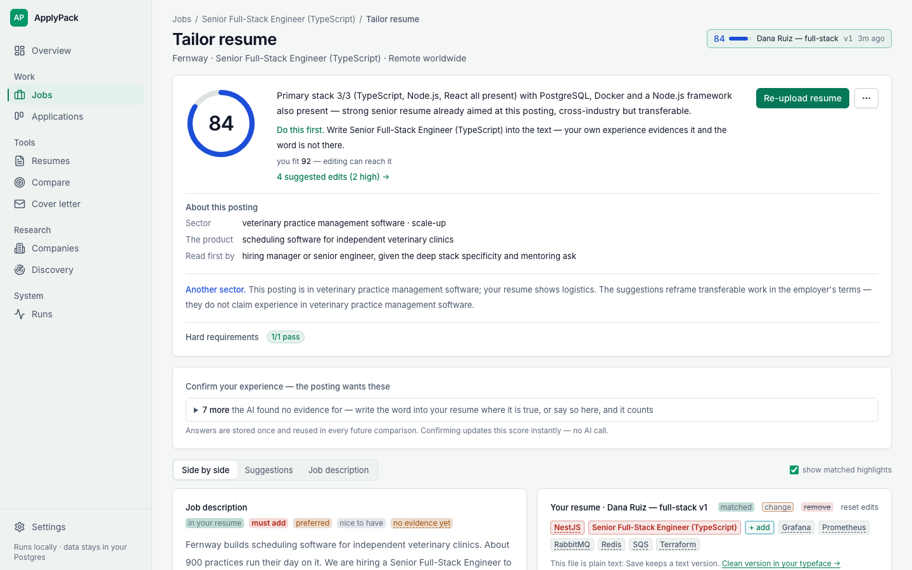
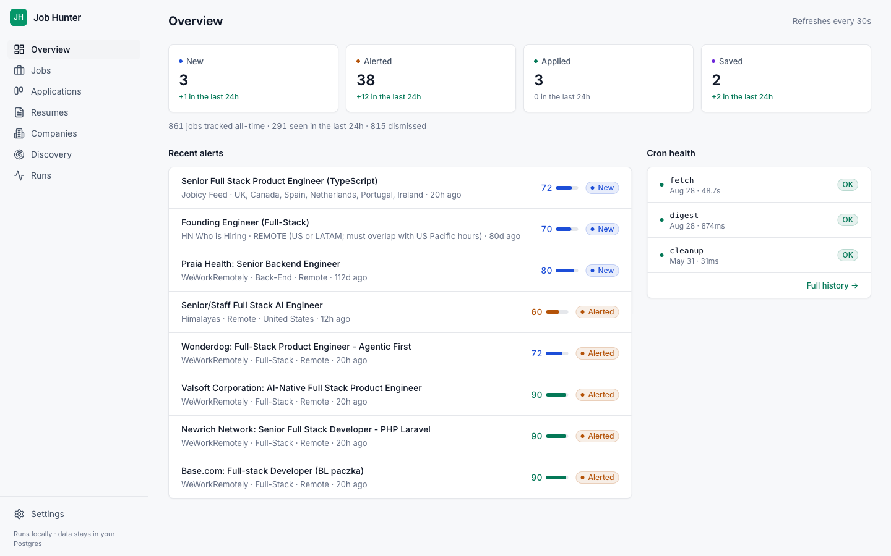
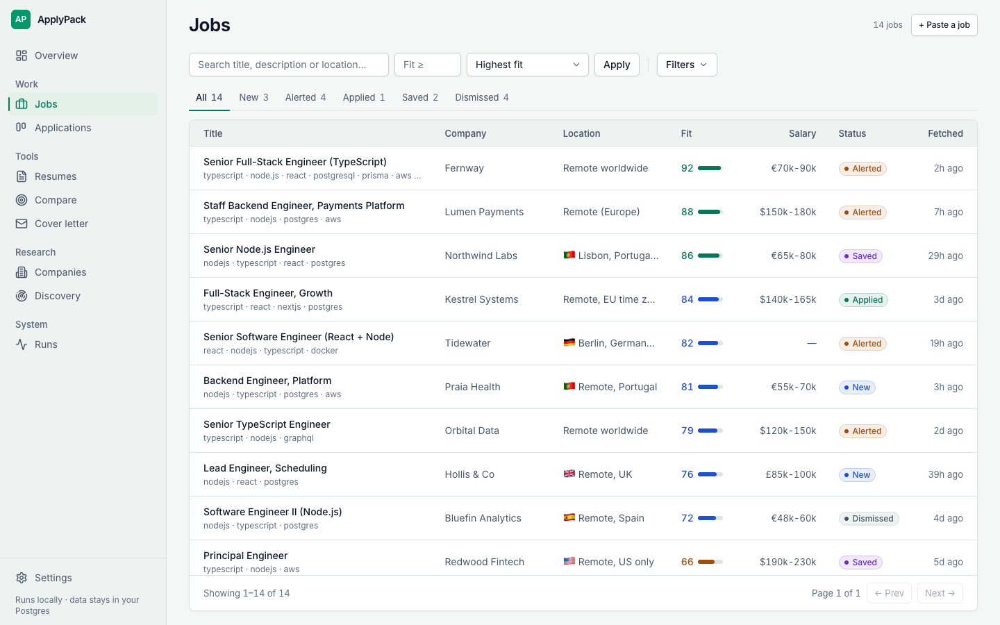

<div align="center">

# ApplyPack

**Free, open-source job search that gets your resume past the keyword filter.**

[](https://github.com/applypack/applypack/actions/workflows/test.yml)
[](https://applypack.dev/demo/)
[](./LICENSE)
[](./package.json)
[](./tsconfig.json)
[](./CHANGELOG.md)

[Quick start](#quick-start) · [What you get](#what-you-get) ·
[How it works](#how-it-works) · [Bring your own AI](#bring-your-own-ai) ·
[What it costs](#what-it-costs) · [Contributing](#contributing)



<sub>The targeted editor: an honest, deterministic resume-vs-posting score,
one-click experience confirmations, live keyword highlights.</sub>

</div>

Companies screen resumes with AI and ATS keyword filters now. The filter
counts words, not years: "PHP 8, Laravel, Symfony" can miss a requirement
that says "PHP", and a recruiter never sees the fifteen years behind it.
Half the postings are noise on top: the wrong stack in paragraph four,
"Remote" that means remote in Germany, a listing nobody will ever fill.

ApplyPack watches 22 kinds of job source around the clock, drops the fake
and wrong-fit postings, shows exactly which words a posting wants and your
resume lacks, helps you fix it in place, and writes a cover letter that
cannot invent. Then it tracks the application.

- **Find real jobs.** 25 sources hourly, a classifier with strict stack
  and location rules, a ghost-job check with evidence links, Telegram only
  above your fit threshold, several searches at once.
- **Fix the resume for this posting.** The model marks facts, code
  computes the score. Edit side by side with a live score; honest deltas
  between versions. [Try it live →](https://applypack.dev/demo/)
- **Write the letter without inventing.** Fact-gated against your resume
  and your confirmed facts. PDF / DOCX.

I built it during my own job search and found my job with it
([the story](https://applypack.dev/#story)). Everything runs on your
machine: your resume, your profile and every AI report stay in your own
Postgres, and `docker compose up` on a laptop or a $5 VPS is the whole
deployment. MIT, no accounts, no telemetry, no ads. Bring your own AI: a
subscription you already pay for, a key, or a local model.

## What you get

The three things above, in full. Every line is a shipped feature, not a
roadmap item.

<details>
<summary><b>The whole list, one line each</b></summary>

| | |
| --- | --- |
| 🔭 **25 source integrations, checked hourly** | The number counts *kinds* of board, not companies: ten ATS vendors — Greenhouse, Lever, Ashby, Workable, SmartRecruiters, Recruitee, Breezy, BambooHR, Pinpoint, Rippling — on as many companies as you care to add, plus 14 cross-company aggregators (DOU and Djinni for Ukraine, solid.jobs for Poland among them) and the monthly HN "Who is hiring" thread. Curated **starter packs** add a whole segment of companies at once |
| 🚀 **A guided first run** | `/welcome` walks a first install through connecting an AI, proving the search works, turning a resume into a profile, and scoring the first matches — four clicks and one file pick |
| 🎯 **Several searches at once** | Backend and QA, or contract and full-time: each search has its own stack, thresholds, resume and Telegram chat, and up to eight run in parallel. One AI call per posting scores all of them, so a second direction costs almost nothing |
| 🧠 **A classifier with strict rules** | AI reads the full description against your stack, role types, seniority, regions and salary floor. "Full-stack" in a title is not a tech match, and "Remote · Germany" is not a US-remote job |
| 📲 **Telegram instead of tab-refreshing** | alerts above your fit threshold, a daily digest, and a nudge when an application goes quiet for two weeks |
| 🕵️ **Ghost-job verification** | a live web-search checklist (careers page, company footprint, posting age, named humans) returns `legit` / `suspicious` / `fake` with evidence URLs |
| 📄 **Resume scores that can't flatter** | the model marks facts, application code computes the score. A Laravel resume cannot sweet-talk its way to 85 against a Node.js posting, and v2 is honestly comparable to v1 |
| ✍️ **Targeted resume editor** | posting and resume side by side, every keyword highlighted, coverage recomputed on each keystroke without spending a single AI call |
| 💌 **Cover letters that can't invent facts** | drafted from the posting, your resume and your own angle notes; every claim passes a fact gate against stored evidence, and the letter exports to PDF / DOCX |
| 🗂 **Application tracking** | a kanban with columns you name yourself, the resume each application went out with, and reminders for the ones gone quiet |
| 🔌 **Five AI backends, auto-failover** | Claude Code / Gemini / Codex CLIs riding your subscriptions, the Anthropic API, or any OpenAI-compatible endpoint including free local models |
| 🧭 **Board discovery** | harvests company ATS boards from HN comments and queues them for a one-click promote |
| 🛡 **Job posts can't hijack the prompt** | every posting, resume and web page reaches the model inside explicit untrusted-text markers, and a test fails the build if a new AI call site skips them |
| 🏠 **Self-hosted and private** | official public APIs and RSS only, dashboard bound to `127.0.0.1`, no accounts, no telemetry |

</details>

## Quick start

```bash
git clone https://github.com/applypack/applypack.git
cd applypack
cp .env.example .env    # nothing to fill in yet
docker compose up -d    # postgres + worker + dashboard → http://localhost:4747
```

**You don't need an API key before the first boot.** Paste one into the
dashboard instead — step 1 of `/welcome`, or **Settings → AI engine** any
time. Keys are stored in Postgres, shown masked, and never logged
([ADR 0027](./docs/adr/0027-ai-keys-in-the-database.md)); `.env` is only the
fallback for engines that have no key saved.

If you'd rather keep credentials in the file, one line still does it:

```bash
ANTHROPIC_API_KEY=sk-ant-...                              # Anthropic API
# or: AI_PROVIDER=claude_code + CLAUDE_CODE_OAUTH_TOKEN=… # Claude.ai subscription
# or: GEMINI_API_KEY=...                                  # Gemini (free tier)
# or: OPENAI_API_KEY=... (+ OPENAI_BASE_URL)              # OpenAI, OpenRouter, Groq, local
```

Either way the AI tab shows, per engine, whether it is usable on this
machine and where its credential came from.

### Your first fifteen minutes

The dashboard opens on a four-step setup (`/welcome`) and walks you
through it — about four clicks and one file pick:

1. **Connect an AI** — paste a key straight into the page, or let it
   detect the engine already configured in `.env` or logged in on this
   machine. A Test button proves the connection before you move on.
2. **Test the search** — one button asks every job board and stores what
   it finds, no AI spent. You watch the sources answer.
3. **Tell us about you** — upload your resume; the summary it comes back
   with ("looks like you're a senior backend engineer — PHP, Laravel…")
   becomes your search profile with one click. No resume handy: three
   questions instead.
4. **See your first matches** — score the jobs found, read the top five,
   then **Start the hourly watch**.

Fetching starts **paused** until that last click, on purpose: a blank
profile would classify everything as a miss and waste your AI quota.
Telegram alerts are optional — **Settings → Notifications** whenever you
like. Skipped the wizard? The Overview keeps a "Finish setup" link.

From then on it runs itself. Every settings change saves to Postgres on
click: no restarts, no `.env` edits. The worker picks changes up within
the hour; dashboard actions use them immediately. Too impatient for the
hourly tick: **Fetch now** on the Overview.

<details>
<summary><b>Running without Docker</b></summary>

The stack is plain Node + Postgres, so a local setup is first-class:

```bash
docker compose up -d postgres   # or any Postgres 16 you already have
cp .env.example .env            # then point DATABASE_URL at that Postgres
npm install
npx prisma migrate deploy
npm run seed

npm run dev                     # the cron worker
npm run dev:web                 # the dashboard → http://localhost:4747
```

`DATABASE_URL` is the only line you must set — with an existing Postgres,
use a role and database you already have. Everything else in `.env.example`
works as shipped, engines included: the dashboard starts without any AI
credential and the AI tab shows you which engines are usable, so you can
pick one there instead of guessing up front.

Run both commands from the repository root — the dashboard serves its
browser modules from `src/web/public/` relative to the working directory.

`WEB_HOST` defaults to `127.0.0.1` here on purpose. The dashboard has no
authentication unless you set `WEB_BASIC_AUTH`, so bind it wider only
together with that. (Under Docker, compose sets `0.0.0.0` for the
container and publishes the port on loopback only.)

Writes are refused when they come from another origin: a POST whose
`Origin` is not this dashboard, or whose `Sec-Fetch-Site` says
`cross-site`, gets a 403. That is what stops a page open in the same
browser from posting to your `localhost:4747`. A request with no browser
origin headers at all — `curl`, a script — is not that attack and passes.
If you put the dashboard behind a reverse proxy, pass the browser's host
through (`proxy_set_header Host $host` in nginx); a proxy that rewrites
`Host` to `localhost` makes every form look cross-origin.

CLI engines (claude / gemini / codex) are simpler locally: install them
globally, log in once in your terminal, and the probe on the AI tab turns
green. Details per engine in [docs/ai-engines.md](./docs/ai-engines.md).

> `dev:web` compiles with `tsc` and reloads with Node's `--watch` rather
> than `tsx`, a deliberate workaround: see gotcha #2 in
> [CLAUDE.md](./CLAUDE.md#gotchas).

</details>

## How it works

```
 25 sources ──▶ normalize ──▶ base filter ──▶ AI classifier ──▶ Postgres ──▶ Telegram
   hourly        + dedupe      pure code,      one call, a       dashboard    only when
   fetch                       zero cost       score per search               fit ≥ threshold
```

Cheap deterministic filters drop the obvious misses first (excluded words
in the title, dead locations). Everything that survives goes to an AI
classifier that reads the full description against **your profile**, with
explicit rules about what counts as a stack match and what counts as a
country lock. Postings that clear your fit threshold land in the
dashboard and, if you want, in your Telegram.

Sourcing is deliberately clean: official public APIs and RSS feeds only,
never scraping. LinkedIn, Indeed, Glassdoor, Workday and Wellfound are
permanently out of scope
([ADR 0005](./docs/adr/0005-no-linkedin-indeed-workday.md)).

### Where the jobs come from

Coverage is two-tier by design, because the big HR vendors have no "all
jobs" API, only per-company endpoints:

- **Direct boards**: Greenhouse, Lever, Ashby, Workable, SmartRecruiters
  boards for companies *you* track. Add one by pasting its board URL on
  `/companies`; the form probes the API live and refuses slugs that
  don't resolve.
- **Aggregators**: RemoteOK, Remotive, We Work Remotely, Jobicy, Working
  Nomads, Himalayas, Laravel Jobs, Golang Projects, Arbeitnow, 4 Day Week,
  solid.jobs (Poland),
  the HN jobs feed and the monthly HN "Who is hiring" thread. Broad and
  noisy, which is fine: the filters and the classifier do the narrowing.

Leave the aggregators on. Turning them off to "only watch real boards"
sounds tidy and produces near-zero new jobs, because a dozen tracked
companies don't post matching roles every week. The long tail comes from
the aggregators; your profile keeps it quiet.

## Bring your own AI

Instead of one hard-coded API key, ApplyPack speaks to **five AI
backends**, and you can attach every subscription and key you own:

| Engine | What it is | Billing |
| --- | --- | --- |
| Claude Code CLI | headless `claude -p` | your Claude.ai Pro/Max subscription |
| Gemini CLI | headless `gemini -p` | your Google account (generous free tier) or an AI Studio key |
| Codex CLI | headless `codex exec` | your ChatGPT Plus/Pro subscription |
| Anthropic API | Messages API | per token |
| OpenAI-compatible API | `POST /chat/completions` to any base URL | OpenAI, OpenRouter, Groq, DeepSeek, or a free local model via LM Studio / Ollama |

On **Settings → AI engine** each backend is a card: enable the ones you
have, arrange them with ↑ Priority, and pick models per engine. Engine #1
serves every call. If it errors, hits a rate limit, or runs out of quota,
the next engine takes over for that call, and #1 is back in charge the
moment it recovers. An engine that fails repeatedly gets a short cooldown
instead of slowing every job down.

The dashboard never guesses about your setup. Every card shows whether
the engine is usable on this machine ("available" vs "not detected", with
the exact missing step), metered engines carry a "pay per token" badge,
and a **Test** button runs one real end-to-end call. A "Last 7 days" line
counts who actually served your calls.

Three model slots per engine keep costs sane: a cheap **classifier
model** reads every fetched job (Haiku 4.5 on the Claude engines), a
strong **resume model** handles the few judgment calls a day — resume
scans, matches, verification (Opus 5 on the Claude engines) — and an
optional **cover-letter model** that follows the resume model unless you
set it.

Setup for every engine, local and Docker, lives in
**[docs/ai-engines.md](./docs/ai-engines.md)**.

One honest note: vendors' consumer-subscription terms don't explicitly
cover running a background service, so read yours before making a
subscription your primary engine. The prompts are tuned against Claude;
expect somewhat different scoring from Gemini or GPT engines (there's a
bench for exactly that: `npm run bench:resume -- --engine all`).

## What it costs

- **Subscriptions you already pay for** (Claude.ai, ChatGPT, Google): $0
  extra. The CLI engines ride the subscription's usage window; when it
  runs dry mid-day, the chain fails over to your next engine and comes
  back on its own.
- **Anthropic API only**: roughly **$2–10/month**. A classified posting
  costs about **$0.003** — ~2,000 input and ~250 output tokens on Haiku
  4.5 — and the bill follows how many postings your sources produce, not
  how many you apply to. The two-stage classifier mode cuts 30–40% more
  by sending most postings a much shorter prompt.
  *No prompt-cache discount is included in that figure, and none applies:
  Haiku 4.5 only caches prefixes of 4,096 tokens or more and our
  classifier prompt is well under that. Measured, not assumed.*
- **Free tier**: Gemini CLI's free quota covers the classifier for a
  typical day; a local model via LM Studio / Ollama through the
  OpenAI-compatible engine costs nothing at all.

Postgres, Telegram and GitHub Actions are free. The "Last 7 days" counter
on the AI tab shows exactly which engine your calls went to.

## Day to day

<div align="center">

</div>

| Page | URL | What it's for |
| --- | --- | --- |
| First run | `/welcome` | The four setup steps; `/` redirects here until you finish or skip |
| Overview | `/` | Counters by status, recent alerts, cron health, pause/resume, Fetch now |
| Jobs | `/jobs` | Filterable, sortable list of everything fetched |
| Paste a job | `/jobs/new` | Save a posting by hand (LinkedIn, email, referral); it gets classified like any other |
| Job detail | `/jobs/:id` | Full description, AI verdict, status actions, verification, resume match, tracking |
| Targeted editor | `/jobs/:id/target` | Posting ↔ resume side by side, live keyword score, edit in place |
| Compare | `/target` | One-shot comparison: paste any posting, pick / upload / paste any resume |
| Cover letter | `/letter` | Write a letter for a posting that isn't stored yet: pick, paste or link it, then draft |
| Applications | `/applications` | Kanban with drag-and-drop. Applied and Rejected/Ghosted are fixed; every column between them is yours to name, add and reorder ([ADR 0025](./docs/adr/0025-custom-work-stages.md)) |
| Resumes | `/resumes` | Upload `.pdf` / `.docx` / `.md` / `.txt`, AI scan, version history |
| Companies | `/companies` | Tracked boards; add new ones with a live probe that refuses bad slugs |
| Discovery | `/discovery` | Board candidates harvested from HN, with the discovery toggles |
| Runs | `/runs` | The last 100 cron runs with stats and errors |
| Settings | `/settings` | Five tabs: General · Profile · AI engine · Notifications · Sources |

<div align="center">

</div>

**The resume toolkit, in practice.** Upload the resumes you actually send
on `/resumes`; each gets one AI scan (headline, seniority, skill tags,
job-agnostic ATS issues). On any job page, **Compare** runs the match and
stores the report: a quick check by default (every keyword graded and
marked, the gates, the score), the edit suggestions one click later. On
the targeted editor you fix the resume in place, watching keyword coverage
update as you type, free of AI calls; re-upload a file and it is scored
in the editor before the AI is asked. Disagree with the model? Re-level a
keyword, ignore it, add the one it missed, or rebuild the whole list; your
edits survive every re-run. When the draft feels right, "Re-check with
AI" gives the honest rubric score and "Save as vN" keeps the version. The
next report shows "▲ +16 vs v1", and the delta is real because the
scoring is deterministic.

<details>
<summary><b>Your data, and how to keep it</b> (backup, restore, what a delete takes)</summary>

Everything lives in one Postgres database — jobs, resumes and their versions,
comparisons, cover letters, applications, and your AI keys if you pasted them
into the dashboard instead of `.env`. Nothing is sent anywhere but the AI
engine you chose and, if you set it up, your own Telegram bot.

Back it up with one command; it is a plain SQL dump:

```bash
docker compose exec -T postgres pg_dump -U jobhunter jobhunter > applypack-$(date +%F).sql
```

Restore into an empty database (stop the app first so nothing writes while it
loads):

```bash
docker compose stop app web
docker compose exec -T postgres psql -U jobhunter -d jobhunter < applypack-2026-09-02.sql
docker compose start app web
```

`docker compose down` keeps the data (it lives in the `pgdata` volume);
`docker compose down -v` deletes it. There is no undo, so take a dump first.

The database port is published on **`127.0.0.1:5433`** for `psql` and Prisma on
the host — loopback only, and 5433 so it does not collide with a Postgres you
already run on 5432. The app itself never uses that port; it reaches Postgres
over the compose network.

Deletes inside the dashboard cascade, and each confirm names what it will take:
deleting a resume takes its comparisons, its cover letters and its strength
reviews; deleting a company takes every job it posted, and with each job the
application you tracked against it.

</details>

<details>
<summary><b>The worker's schedule</b> (six cron jobs, <code>TZ</code> from <code>.env</code>)</summary>

| Cron | Job | What it does |
| --- | --- | --- |
| `5 * * * *` | fetch | Pull all sources → filter → classify → alert |
| `0 9 * * *` | digest | Telegram digest of the last 24h of new/alerted jobs |
| `0 8 * * *` | stale-applications | Nudge for applications quiet for 14+ days |
| `0 3 * * 0` | cleanup | Drop dismissed jobs older than 30 days, trim usage counters |
| `0 4 * * 0` | discovery | Re-probe pending company candidates |
| `0 6 1 * *` | hn-hiring | Pull the monthly HN "Who is hiring" thread |

Every cron has a matching one-shot script for manual runs
(`docker compose exec app node dist/scripts/<name>-once.js`, or
`npm run <name>:once` locally).

</details>

## Under the hood

TypeScript strict, Node 24, Prisma + Postgres 16, Hono for the dashboard
(server-side JSX, no build step), node-cron for scheduling. Deliberately
no Redis, no queues, no framework sprawl. Every external byte (env vars,
API responses, AI output) passes through zod before it's trusted. The
worker and the dashboard are separate processes sharing one database, so
a toggle flipped in the UI reaches the worker on its next tick.

```bash
npm run lint:types   # tsc --noEmit
npm test             # node --test, over a thousand unit tests on the pure modules
```

CI runs both on every push. AI- and DB-touching modules are verified by
smoke runs and the dashboard instead of mocks; the philosophy is written
down in [CLAUDE.md](./CLAUDE.md).

> **Docs map:** [SPEC.md](./SPEC.md) — current behaviour, phase by phase ·
> [ARCHITECTURE.md](./ARCHITECTURE.md) — data-flow diagrams + file map ·
> [CLAUDE.md](./CLAUDE.md) — conventions, gotchas, where-to-look tables ·
> [docs/ai-engines.md](./docs/ai-engines.md) — AI setup, local + Docker ·
> [docs/adr/](./docs/adr/) — every non-obvious decision, with reasons ·
> [CHANGELOG.md](./CHANGELOG.md) — releases.

## Contributing

Ideas are welcome, not just patches. Anything that fits the sourcing
policy can land here: open an issue with the
[feature template](https://github.com/applypack/applypack/issues/new/choose)
and it gets scoped in the open. The roadmap is the issue tracker, on
purpose; [#24](https://github.com/applypack/applypack/issues/24) (a Discord
channel next to Telegram) is the kind of task that is waiting for someone.

Three good entry points:

- **Add a job source.** The highest-value contribution, and close to a
  one-file change: CLAUDE.md ships three copy-paste fetcher templates
  (single RSS, per-company JSON, list + detail). Propose the source in an
  issue first if you're unsure it fits the sourcing policy.
- **Grab a [good first issue](https://github.com/applypack/applypack/labels/good%20first%20issue).**
  Scoped tasks with file pointers.
- **Break it and report.** A fresh-machine setup that stumbled, an ATS
  edge case, a resume that parses badly: issues with logs are gold.

[CONTRIBUTING.md](./CONTRIBUTING.md) is a five-minute read covering
setup, tests and conventions. The sourcing policy is non-negotiable:
official public APIs and RSS only, never scraping
([ADR 0005](./docs/adr/0005-no-linkedin-indeed-workday.md)).

<a href="https://github.com/applypack/applypack/graphs/contributors">
  
</a>

## License

MIT — see [LICENSE](./LICENSE).

Built and maintained by [Nazar Boyko](https://github.com/nazboyko).
Every decision that was not obvious is written down in
[docs/adr/](./docs/adr/).
